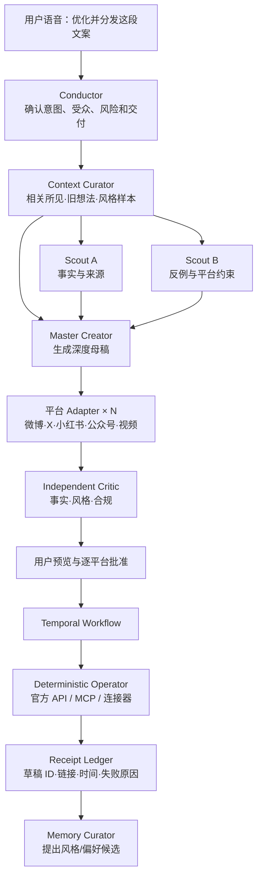

# 「显现 OS」Agent Fabric 技术架构 v0.1

> 日期：2026-07-21  
> 状态：历史技术候选与研究快照，须通过验证后锁定；不作为当前契约规范  
> 目标：一个连续人格，多个受控 Agent，按任务选择模型，并能在崩溃、等待和重试后继续完成真实行动。

> 当前可执行架构以 [`docs/architecture`](./docs/architecture/system-overview.md)、[`contracts/schemas`](./contracts/schemas/v1/) 与代码测试为准。本文件中的接口代码只表达设计意图，可能落后于版本化契约。

## 0. 结论

首选组合调整为：

```text
Agent Runtime / Harness：AgentScope Java 2.0 HarnessAgent
Durable Action Runtime：Temporal Java SDK
Product Control Plane：自有 Emerge Agent Fabric
Specialized Worker：Pi（代码、仓库或终端型任务，可选）
Protocols：MCP 管工具，A2A 只管外部 Agent，AG-UI 管前端事件
```

这里不是把产品交给 AgentScope。产品真正独有的部分仍由 `Emerge Agent Fabric` 掌握：

- 用户唯一人格与 Self Model；
- 任务本体、上下文切片和证据血缘；
- 模型路由、预算、隐私与数据地域策略；
- 行动授权、幂等、回执和结果学习；
- Agent/Prompt/Skill 的评测、晋升和回滚。

AgentScope 只是可替换的 Agent Kernel 实现。它在 2026-07-10 才发布 2.0.0 GA，功能与本项目高度匹配，但生产成熟度仍要通过故障注入和真实 Dogfood 证明。

---

## 1. 先把术语分清

| 层 | 负责什么 | 本项目选择 |
|---|---|---|
| 模型运行时 | 推理、语音、图像、视频生成 | 多供应商 API / 可选本地模型 |
| Agent Kernel | 单个 Agent 的模型—工具循环、流式事件、上下文 | AgentScope `ReActAgent` |
| Agent Harness | Session、Subagent、权限、沙箱、技能、压缩 | AgentScope `HarnessAgent` + 自有约束层 |
| Agent Fabric | 任务分解、模型路由、记忆视图、预算、评测、审计 | 自研，属于产品核心 |
| Durable Runtime | 等待、定时、重试、补偿、崩溃恢复 | Temporal |
| 工具协议 | 接平台、数据源和执行能力 | MCP / 官方 API |
| Agent 协议 | 跨服务、跨组织调用独立 Agent | A2A，仅外部边界使用 |

不能把 Ollama/vLLM、MCP、Dify、AgentScope、Temporal 叫成同一层：前两者分别是推理运行时和协议，Dify 是应用平台，AgentScope 是 Agent Runtime/Harness，Temporal 是持久工作流运行时。

---

## 2. 核心形态：一个“她”，多个短命工作线程

用户只和一个稳定的 **Conductor / Presence** 交互。它负责：

- 理解用户当下真正想要什么；
- 维护关系连续性与表达一致性；
- 决定直接回答、调用单个 Worker，还是提出任务图；
- 汇总结果、解释分歧并向用户交付；
- 绝不直接扩大权限或绕过审批。

内部 Subagent 是临时的、专业的、可丢弃的 Worker：

- 不拥有独立人格；
- 不获得完整人生档案和全部聊天历史；
- 不直接修改 Self Model；
- 不直接公开发帖、付款、删除或代表用户联系他人；
- 只返回结构化 Artifact、证据、置信度和失败信息；
- 默认不能再生成子 Agent。

因此产品是：

> **One Self, Many Workers；不是 Many Selves。**

---

## 3. 为什么首选 AgentScope Java 2.0

它已经原生提供本项目最难、最不适合重复造轮子的 Harness 能力：

- `HarnessAgent` 与无状态 `ReActAgent`；
- `agent_spawn`、`agent_send`、同步/后台 Subagent；
- 每个 Subagent 独立模型、会话、工作区、工具 allowlist 和最大步数；
- ALLOW / ASK / DENY 三态权限以及不可绕过的工具级检查；
- HITL 暂停与精确恢复；
- Context compaction、大工具结果 spill、长期记忆和 Skill；
- Docker/Kubernetes/E2B 等沙箱抽象；
- 按 `(userId, sessionId)` 隔离并支持 Redis/PostgreSQL 等分布式存储；
- OpenAI、Anthropic、Gemini、DeepSeek、Qwen、Ollama 等模型扩展；
- MCP、A2A、AG-UI 与 OpenTelemetry 集成。

它也符合我们的工程现实：

- 你能用 Java 读懂、修改、压测和解释整个 Runtime；
- Reactor、Spring Boot、PostgreSQL、Redis、OpenTelemetry 与现有经验连续；
- Apache-2.0，属于可嵌入基础设施，不是一个需要围绕其 UI 生长的成品壳。

### 必须正视的缺口

AgentScope 的状态默认在一次 `call()` 结束时保存，而不是每个推理/工具步骤都成为确定性的耐久事件。因此：

- 进程在一次长调用中间死亡，部分推理工作可能重做；
- 不能仅依赖它保证发布、付款、消息发送永不重复；
- 2.0.0 GA 很新，跨副本、后台任务、HITL 与沙箱组合仍需压测；
- Harness 内建 Memory/Skill 不能直接成为产品的 Self Model 真相源。

所以边界必须是：

> **AgentScope 管“怎样思考与协作”；Temporal 管“事情必须最终完成且不能重复做”。**

---

## 4. Pi 的新位置

Pi 不再作为全局中心 Runtime，而是保留为可选的专业 Worker：

- 代码仓库阅读、修改、测试和终端任务；
- 快速试验不同 provider/model；
- 研究极简 Agent loop、事件流和 context transformation；
- 在隔离容器里执行明确的 Coding Task。

原因是 Pi 的优点正是小、透明、可嵌入；但官方明确不内建生产级 Subagent、权限弹窗和沙箱。让它承担整个 Personal AI OS，会迫使我们从零补齐最危险的系统工程。

接入方式：

```text
Temporal Activity
  → Coder AgentScope Subagent
  → 启动隔离的 Pi RPC/SDK Worker
  → 返回 patch、测试结果和 trace
  → Reviewer 验证
```

Pi 不接触用户永久记忆，不持有平台长期凭证，也不直接执行生产发布。

---

## 5. Agent 不是模型，而是一份执行契约

```ts
interface AgentSpec {
  role: string;
  instructionsVersion: string;
  capabilityProfile: CapabilityProfile;
  inputSchema: string;
  outputSchema: string;
  toolAllowlist: string[];
  memoryScopes: string[];
  sandboxClass: "NONE" | "READ_ONLY" | "ISOLATED_WRITE" | "NETWORKED";
  maxTurns: number;
  maxToolCalls: number;
  maxChildren: number;
  timeoutMs: number;
  budgetUsd: number;
  riskCeiling: RiskLevel;
  canSpawn: boolean;
  reviewPolicy: string;
}
```

同一个 `Creator` 可以今天由模型 A 执行、下月由模型 B 执行；它的任务契约、权限和验收标准不变。模型升级不应重写业务流程。

---

## 6. 第一批 Agent 角色

| 角色 | 职责 | 默认权限 | 记忆视图 |
|---|---|---|---|
| Conductor | 意图理解、分派、综合、对话 | 读；只能提出行动计划 | 当前 Working Self |
| Context Curator | 从经历与资料中组装最小上下文 | 只读 | evidence IDs + 当前任务相关片段 |
| Scout | 搜索、订阅、来源核验、反例 | 只读网络 | 主题、来源策略，不看敏感人格 |
| Thinker | 深度推演、决策和冲突分析 | 无外部副作用 | 目标、约束、相关经历 |
| Creator | 母稿、脚本和内容适配 | 写 Artifact，不发布 | 风格样本、受众、已确认观点 |
| Critic | 事实、风格、合规、计划审校 | 只读 | Artifact + 证据，不看 Producer 的自由推理 |
| Memory Curator | 提出事实/偏好/技能候选 diff | 只能写候选区 | 原始事件与修订结果 |
| Operator | 把已批准 ActionPlan 交给连接器 | 最小 capability token | 不读取人格，只读批准计划 |
| Coder | 构建、测试、修复系统 | 隔离工作区 | repo context，不读私人记忆 |

`Operator` 尽量不是自由自治 Agent。它的理想形态是：模型生成严格 `ActionPlan`，确定性代码校验，Temporal Activity 执行，平台回执证明完成。

---

## 7. 任务信封：所有分派的共同语言

以下代码是早期概念草图，不是公共 Schema。规范字段和兼容性边界见 [`TaskEnvelope v1`](./contracts/schemas/v1/task-envelope.schema.json) 与 `modules/contracts`。

```ts
interface TaskEnvelope {
  id: string;
  parentId?: string;
  kind: TaskKind;
  intent: string;
  inputRefs: string[];
  evidenceRefs: string[];
  modalities: Array<"text" | "image" | "audio" | "video">;
  dataClass: "PUBLIC" | "PERSONAL" | "SENSITIVE" | "SECRET";
  risk: "READ_ONLY" | "REVERSIBLE" | "EXTERNAL" | "IRREVERSIBLE";
  latency: "REALTIME" | "INTERACTIVE" | "DEEP" | "ASYNC";
  requiredTools: string[];
  outputSchema: string;
  acceptanceChecks: string[];
  allowParallel: boolean;
  deadlineMs: number;
  budgetUsd: number;
  idempotencyKey?: string;
}

interface ResultEnvelope {
  taskId: string;
  status: "SUCCEEDED" | "FAILED" | "NEEDS_INPUT" | "BLOCKED";
  artifactRefs: string[];
  evidenceRefs: string[];
  claims: Array<{ text: string; evidenceRefs: string[]; confidence: number }>;
  uncertainty: string[];
  receipts: string[];
  resolvedModel: string;
  agentVersion: string;
  costUsd: number;
  latencyMs: number;
  traceId: string;
}
```

Agent 之间不共享可变聊天记录，不发送隐藏思维链，只交换这种可验证的任务与结果。

---

## 8. 多模型路由

业务只请求能力档，不写死厂商模型名：

```text
REALTIME_VOICE
FAST_STRUCTURED
BALANCED_AGENTIC
DEEP_REASONING
LONG_MULTIMODAL
CREATIVE_TEXT
CODE_AGENTIC
INDEPENDENT_CRITIC
PRIVATE_LOCAL
```

路由分两步。

### 8.1 先做硬过滤

- 数据等级、地域、保留和训练政策是否允许；
- 是否支持所需模态、上下文、结构化输出和工具；
- 是否为生产允许的固定版本，是否已弃用；
- 是否满足最小质量、健康度、预算和延迟；
- 是否需要与 Producer 不同的模型族来降低同源错误。

任何硬条件不满足就安全停止，不能为了完成任务偷偷降低隐私或权限。

### 8.2 再做加权选择

```ts
score =
  0.45 * observedTaskQuality
  + 0.20 * toolAndSchemaReliability
  + 0.15 * providerHealth
  + 0.10 * latencyFit
  + 0.10 * costFit;
```

权重不是永久常数，而由真实任务评测校准。原则是先达到质量和安全下限，再优化成本。

### 8.3 截至 2026-07-21 的首批候选池

| 能力档 | 候选 | 用途 |
|---|---|---|
| Realtime | GPT-Realtime-2.1 mini；Gemini 3.1 Flash Live 作为 challenger | 语音快回路 |
| Fast | GPT-5.6 Luna、Gemini 3.1 Flash-Lite、DeepSeek V4 Flash | 分类、抽取、记忆候选、平台适配 |
| Balanced | GPT-5.6 Terra、Claude Sonnet 5、Gemini 3.5 Flash | Conductor、研究、规划、日常创作 |
| Deep | GPT-5.6 Sol、Claude Fable 5 / Opus 4.8、DeepSeek V4 Pro | 困难推理、重要审校、复杂编码 |
| Long multimodal | Gemini 3.5 Flash | 长 PDF、音视频、混合素材 |
| Creative | 不预设冠军 | 用你的真实文章与修改记录盲测 |

首版不同时接入所有厂商。建议先接：

1. OpenAI Luna / Terra / Sol：形成一个稳定的快、中、强基线；
2. Gemini 3.5 Flash：长多模态和跨厂商故障备用；
3. 一个中文 challenger：DeepSeek 或 Qwen，先只做影子评测；
4. 语音使用独立 Realtime 模型，但深度结论转交正式 Runtime。

生产一律记录实际解析出的固定模型版本，`latest` 别名只进 shadow/canary。

---

## 9. 什么时候才生成 Subagent

```ts
function shouldFanOut(plan: Plan, task: TaskEnvelope) {
  return plan.independentBranches >= 2
    && plan.sharedMutableWrites === 0
    && task.allowParallel
    && task.risk !== "IRREVERSIBLE"
    && plan.estimatedAddedCost <= task.budgetUsd * 0.4;
}
```

适合拆分：

- 多来源研究、正反证据并行；
- 多种方案或视觉/内容方向；
- 各平台内容适配；
- 独立事实审校、代码测试和安全复核；
- 不同故障假设的并行诊断。

不适合拆分：

- 一段连续推理或很小的任务；
- 多 Agent 同时修改一个 Artifact；
- 唯一瓶颈是一个外部 API；
- Schema、测试或数据库约束已经能确定性验证；
- 只是为了看起来“很 Agent”。

首版硬限制：

- 最大并发 Worker：3；
- 最大深度：2，但默认只有一层；
- 单任务最多 6 个 Worker；
- 只有 Conductor/Planner 可申请 fan-out；
- Worker 默认 `canSpawn=false`；
- 至少保留 25% 预算给最终综合、验证和失败恢复；
- 父任务取消时，取消信号必须向所有子任务传播。

---

## 10. 四种协作模式

### A. 单 Agent

默认模式。普通聊天、捕获、抽取、小修改不产生 Subagent。

### B. Manager-as-tools

Conductor 保持控制，把边界清晰的子任务交给 Worker，最后统一交付。它是本产品最主要的多 Agent 形态。

### C. 确定性流水线 / DAG

研究 → 母稿 → 审校 → 审批 → 发布。流程由代码或 Temporal 决定，模型只填结构化节点结果。

### D. Producer → Critic → 一次修订

只用于重要长文、高代价决策和难以用确定性测试验证的结果。默认只允许一轮，避免无限“反思”。

不采用默认自由群聊、角色辩论会或长期自治 Agent 社会。Handoff 也很少使用，因为用户可见人格不能频繁易主。

---

## 11. 典型闭环：一句话变成跨平台作品



关键点：平台 Adapter 可以用便宜模型并行；母稿与重要审校使用更强模型；发布动作不交给任何 LLM 自由决定。

---

## 12. 记忆与人格隔离

永久人格只有一份，存在产品自己的 Self Model 与 Evidence Ledger 中。AgentScope 的 `MEMORY.md` 或 Workspace Persona 只能作为 Runtime 投影，不是真相源。

`Memory Broker` 按角色生成最小 `Working Self`：

- Scout：关注主题、来源偏好和时间范围；
- Creator：已确认观点、风格规则、受众和样稿；
- Thinker：目标、约束、相关经历和冲突；
- Operator：已批准 ActionPlan 与 capability token；
- Critic：Artifact、证据和验收规则；
- Coder：仓库上下文，不读取私人记忆。

所有 Worker 只能提交 `MemoryCandidate`：

```text
claim + evidence_ids + scope + confidence + sensitivity
reason + conflicts + expires_at + proposed_by_run
```

候选经过冲突检查、用户确认或受控晋升流程后，才能进入正式用户模型。

---

## 13. 权限与行动安全

使用三重边界：

1. **AgentScope PermissionEngine**：每个工具调用 ALLOW / ASK / DENY；父级 DENY 向子级继承。
2. **Emerge Policy Gate**：根据数据、账号、对象、次数、预算、时间窗和风险签发 capability token。
3. **Temporal Action Workflow**：审批、幂等、重试、补偿、超时与真实回执。

例如“上传公众号草稿”的 capability：

```json
{
  "subject": "operator-run-123",
  "action": "wechat.draft.create",
  "account": "approved-account-id",
  "artifact": "article-version-7",
  "maxCalls": 1,
  "expiresAt": "2026-07-21T22:00:00+08:00",
  "idempotencyKey": "wechat-draft-article-7"
}
```

密钥、Cookie 和私钥永不进入模型上下文，只传不可反推秘密的 capability handle。

---

## 14. Temporal 的精确边界

Temporal 不记录每个 token；它负责粗粒度、需要可靠性的任务状态。

- 一次“生成并分发内容”是 Workflow；
- 独立研究分支可以是 Child Workflow；
- LLM 调用、搜索、渲染和平台 API 是 Activity；
- 用户审批通过 Signal/Update 恢复；
- 每个外部副作用 Activity 必须带幂等键；
- Activity 只返回 Artifact/Receipt 引用，大对象进入对象存储；
- 失败必须区分可重试、需用户修正、永久失败和需要补偿。

AgentScope 的一次 `call()` 作为 Activity 执行。即使它重做推理，也不能重做已经成功且有回执的外部副作用。

---

## 15. 选型矩阵

| 方案 | 优势 | 关键缺口 | 本项目位置 |
|---|---|---|---|
| AgentScope Java 2.0 | 异构 Subagent、权限、HITL、沙箱、状态、Java | GA 太新；非逐步骤 durable | **首选 Harness 候选** |
| Temporal | 跨故障等待、重试、消息、补偿 | 不是 Agent loop | **持久行动底座** |
| Pi | 极简透明、多 Provider、SDK/RPC、代码任务强 | 无原生生产 Harness | **隔离 Coding Worker / 对照实现** |
| LangGraph | Subgraph、checkpoint、interrupt、图执行成熟 | 与 AgentScope + Temporal 重叠；主栈偏 Python | **若转 Python 的首选备胎** |
| OpenAI Agents SDK | Agent-as-tool、handoff、HITL、trace 上手快 | OpenAI-first；Hosted 多 Agent 仍有约束 | Provider 实验，不做中心 |
| Google ADK | 多 Agent、图工作流、A2A、跨语言 | 各语言能力和恢复语义仍不齐 | 跟踪与模式参考 |
| Microsoft Agent Framework | Workflow、HITL、OTel、.NET/Python 完整 | 与当前 Java 主线不匹配 | 不选主栈 |
| Hermes / OpenClaw | 个人 Agent、渠道、Gateway、记忆实践丰富 | 成品状态模型重；在途任务可靠性边界 | 能力实验台与竞品参考 |

为了避免框架锁定，业务只依赖自有端口：

```java
interface AgentKernel {
    AgentRun start(TaskEnvelope task, ResolvedAgentSpec spec);
    AgentRun resume(String runId, HumanDecision decision);
    void cancel(String runId);
    Flux<AgentEvent> events(String runId);
}
```

首个实现为 `AgentScopeKernel`；保留 `PiKernel` 或 `LangGraphKernel` 的实验适配可能性。

---

## 16. 两周技术验证：通过才锁定 AgentScope

### Week A：能力与隔离

1. 建立 Java 21 + AgentScope Java 2.0.0 + Temporal 的最小工程。
2. 一个 Conductor 同时调用三个不同模型/工具 allowlist 的 Subagent。
3. 验证每个 Worker 的 session、workspace、memory scope 和 token 统计互相隔离。
4. 验证父级 DENY 无法被子 Agent 绕过，ASK 能暂停并恢复。
5. 验证大工具结果 spill、compaction 后 evidence ID 仍可定位原文。
6. 把 typed Agent events 映射成我们的 AG-UI 事件子集。

### Week B：故障与真实行动

1. 在模型调用、工具执行、等待审批和平台调用四个位置强杀进程。
2. Temporal 恢复 Workflow；已成功的发布 Activity 不重复执行。
3. Redis/PostgreSQL 状态下进行双副本切换和同 session 并发测试。
4. 注入 429、超时、无效 JSON、context overflow 和 provider outage。
5. 跑 30–50 条用户真实金标，对比单 Agent、三 Worker 与 Pi 对照组。
6. 记录质量、成本、p95、重复动作、未授权动作和恢复成功率。

### 锁定门槛

- 0 次未授权工具调用；
- 0 次重试导致重复发布；
- kill/restart 后 100% 能恢复到可解释状态；
- 同 user/session 串行，不同 session 可并行且不串数据；
- 多 Agent 相对单 Agent 仅在目标任务上获得可测质量或延迟收益；
- AgentScope 相关代码被 `AgentKernel` 适配层限制，不渗透 Self Model 与业务域。

若失败：优先退到 `Pi + 自有 Harness + Temporal`；若主要问题是图状态与 checkpoint，则评估 LangGraph，不带着沉没成本硬撑。

---

## 17. 模型、Agent 与 Skill 的自我进化

按 `TaskKind × 语言 × 数据等级 × 模态` 维护 champion/challenger：

```text
新模型/新 AgentSpec/新 Skill
  → 离线金标回放
  → Shadow：看真实任务但不执行动作
  → 用户盲测或确定性评分
  → 5% Canary
  → 25% / 50% / 100%
  → 持续监控与自动回滚
```

必须记录：

- task kind、AgentSpec/Prompt/Skill 版本；
- 解析后的固定模型版本与路由理由；
- evidence IDs、tool grants、工具事件和回执；
- token、费用、延迟、重试、压缩与缓存；
- 验证结果、用户修改和“不像我”反馈；
- 是否产生了人格/技能候选以及最终是否晋升。

Preview 模型不能自动进入敏感数据和公开行动线路。安全拒绝不能通过换供应商绕过。

---

## 18. 当前官方依据

- [AgentScope Java 2.0.0 Release Notes](https://java.agentscope.io/v2/en/docs/others/release-notes.html)
- [AgentScope Harness Architecture](https://java.agentscope.io/v2/en/docs/harness/architecture.html)
- [AgentScope Subagent](https://java.agentscope.io/v2/en/docs/harness/subagent.html)
- [AgentScope Permission System](https://java.agentscope.io/v2/en/docs/building-blocks/permission-system.html)
- [AgentScope Context & AgentState](https://java.agentscope.io/v2/en/docs/building-blocks/context.html)
- [Temporal Durable Execution](https://docs.temporal.io/temporal)
- [Pi](https://pi.dev/) / [Pi SDK](https://pi.dev/docs/latest/sdk)
- [LangGraph](https://docs.langchain.com/oss/python/langgraph/overview) / [Subgraphs](https://docs.langchain.com/oss/python/langgraph/use-subgraphs)
- [OpenAI Agents SDK orchestration](https://openai.github.io/openai-agents-python/multi_agent/)
- [Google ADK workflows](https://adk.dev/agents/workflow-agents/)
- [OpenAI Models](https://developers.openai.com/api/docs/models)
- [Claude Models](https://platform.claude.com/docs/en/about-claude/models/overview)
- [Gemini Models](https://ai.google.dev/gemini-api/docs/models)
- [DeepSeek Models](https://api-docs.deepseek.com/quick_start/pricing)

## 下一步唯一动作

建立一个两周 `runtime-spike`，只验证：**三个异构 Subagent 完成“资料核验 → 母稿 → 独立审校”，用户批准后由 Temporal 上传一个可撤销草稿；随后在四个关键位置强杀进程并证明不会丢任务、串记忆或重复发布。**
