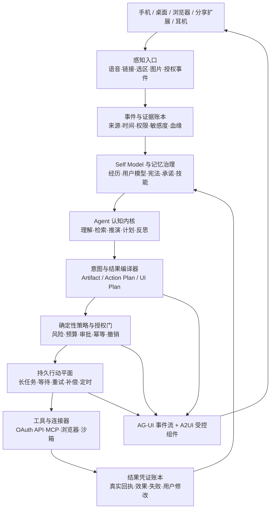

# 「显现 OS」产品蓝图 v0.1

> 日期：2026-07-21  
> 工作名：显现 / Emerge  
> 定位：Personal AI OS，不是聊天机器人、笔记 App 或自动化工具箱。

## 0. 结论先行

这个方向值得长期投入，但不能从“造一个全能、像人、什么都能替我做的 AI 朋友”开工。正确的首战是：

> **把一个人刚刚看到、想到、想要的东西，在几分钟内变成有证据、可编辑、可执行、可复盘的作品或行动。**

系统的基本闭环不是“问答”，而是：

> **见 → 思 → 愿 → 行 → 省 → 再见**

- **见**：捕获所见、所闻、所处情境。
- **思**：把碎片关联为问题、判断、洞见和未决冲突。
- **愿**：识别真正意图、约束、优先级和成功标准。
- **行**：生成作品，或在授权范围内执行外部行动。
- **省**：用用户修改、真实结果和失败凭证更新认知与技能。

北极星承诺：

> **从一个念头到可用成果少于五分钟；每用一次，更像你，而不是更像模型。**

北极星指标不是聊天时长，而是：

> **每周由用户原始“种子”产生的已验证成果数。**

---

## 1. 产品宪章

### 1.1 她是什么

她是四种角色的统一，但角色有明确边界：

- **助手**：保存上下文、降低摩擦、完成重复劳动。
- **伙伴**：共同推演、反驳、补足盲点，不只是顺从。
- **朋友般的关系体验**：有连续性、温度和默契，但始终明确自己是 AI，不诱导依赖。
- **你的行动外骨骼**：把意图编译为计划、作品和受控行动。

“你中有我、我中有你”的工程含义是共同塑造，而不是身份混同：你的经历、价值和选择持续塑造系统；系统的整理、推演和行动又扩展你的能力。**共生不等于复制意识，也不等于让 AI 冒充你。**

### 1.2 人和 AI 各自该做什么

人应保留：

- 价值选择、目标定义和最终责任；
- 真实关系、身体经验、审美判断与意义赋予；
- 对不可逆行动的授权；
- 对 AI 推断的纠正和反驳。

AI 应承担：

- 忠实捕获、关联、整理和检索；
- 多方案推演、证据核验和风险提示；
- 重复创作、格式适配、流程执行和状态追踪；
- 在有限权限内监控、提醒和自动完成；
- 从修改与结果中改进工作方法。

### 1.3 明确不做

- 不以替代现实社交、制造依赖或延长停留时长为目标。
- 不承诺“无感读取所有 App”；移动系统也不允许这样做。
- 不把向量库、聊天记录或一个 `SOUL.md` 冒充完整人格。
- 不让模型自行扩大权限、安装未知技能、改生产代码或改写价值观。
- 不以全平台无人值守发布作为首版卖点。
- 不用隐藏 API、Cookie 抓取或脆弱 UI 自动化承载核心业务。

---

## 2. 第一产品楔子：Thought-to-Outcome

宏大系统先通过一个真实、高频、可量化的闭环长出来：

```text
语音/分享一个念头
  → 关联最近读过与保存的材料
  → 生成观点、提纲和长文
  → 用户修改
  → 生成各平台版本与素材
  → 预览、确认
  → 首先交付到一个真实平台
  → 保存平台回执与后续反馈
  → 学会你的表达和工作方式
```

首个真实动作建议选 **“经确认后上传公众号草稿”**，而不是直接公开发布。原因：

- 长文最能暴露系统是否真的理解了你的思考；
- 草稿是可撤销、低风险、有平台回执的外部结果；
- 一份深度母稿可以再适配微博、X、小红书和视频脚本；
- 现有本机已经有过相关发布路径，可作为集成实验，但实施前仍需重新验证账号、权限和平台状态。

第二个平台再选微博或 X；小红书、抖音先采用“生成完整素材 + 唤起 App + 用户确认发布”，直到官方权限与稳定性被证明。

---

## 3. 交互：一个稳定入口，一块动态画布

### 3.1 首屏

首屏不是功能宫格，也不是聊天历史。它只保留一个有生命感但克制的 **Presence**：

- 点击说话，长按连续对话；
- 同步显示可编辑转写，口误不会直接变成永久记忆；
- 底部只有文字、附件、相机三个弱入口；
- 状态只显示：`听见 → 理解 → 行动 → 交付`；
- 随时可打断、改向、取消。

分享菜单、锁屏控件、桌面快捷键都复用三个自然动作：

- **收下**：保存当前内容与来源。
- **想想**：联系已有认知，整理、分析或追问。
- **去做**：创建作品、任务或外部行动。

目标是：**两秒进入、三秒确认捕获完成。**

### 3.2 动态 UI 的边界

真正高级的动态 UI 不是让模型临时写 HTML，而是：

> **稳定的交互语法 + 有限的高品质组件 + 动态编排。**

固定不变的信任锚点：

- 输入和中断；
- 当前任务状态；
- 来源与“为什么这样判断”；
- 授权、取消和撤销；
- 最终结果与凭证。

首批动态组件目录：

1. 来源卡：原文、作者、时间、授权和引用位置。
2. 思考线：碎片之间的支持、冲突、追问与演化。
3. 决策卡：目标、选项、代价、建议与失效条件。
4. 作品编辑器：提纲、文章、图片、视频脚本和版本差异。
5. 行动审批卡：将做什么、用什么账号、影响谁、能否撤销。
6. 执行进度卡：当前步骤、工具事件、失败原因、停止按钮。
7. 结果凭证卡：平台 ID、链接、时间、截图或 API 回执。
8. 记忆变更卡：新增了什么认识、依据、置信度、确认/修改/拒绝。

主动出现时一次最多一张卡，并始终提供：`为什么告诉我 / 稍后 / 少推荐这类`。

### 3.3 审美方向

产品气质应是“安静的智慧”，不是赛博朋克控制台：

- 大留白、低噪声、自然动效；
- 内容优先，技术状态只在需要时展开；
- 人格差异体现在语气、信息密度、排序、色彩和动效节奏，不破坏导航与可访问性；
- 不用“无限聊天气泡”承载一切，交付物应像真正的文章、计划、工作台和回执。

视觉方案暂不锁定；等第一个闭环确定后，再分别生成三套方向并做可用性选择。

---

## 4. “人格”在系统里的真正承载方式

人格不是 Prompt，而是六层相互制约的状态。

| 层 | 内容 | 更新权 |
|---|---|---|
| 原始经历账本 | 看过、说过、写过、决定过、做过及其结果 | 只追加；保留来源 |
| 用户模型 | 事实、兴趣、偏好、能力、风格、决策习惯 | 系统提出候选，用户可改 |
| 个人宪法 | 价值观、长期目标、禁区、授权原则 | 用户明确确认才能改 |
| 当前状态 | 项目、承诺、优先级、精力、期限 | 事件驱动，允许快速过期 |
| 关系记忆 | 共同经历、形成的默契、有效纠正 | 可审阅、可删除 |
| 程序性记忆 | 模板、技能、工作流、成功/失败经验 | 评测与审批后晋升 |

每条“她对你的认识”至少包含：

```text
claim / type / evidence_ids / confidence / scope
valid_from / expires_at / user_confirmed
contradicts / supersedes / sensitivity / access_policy
```

关键原则：

- **经历是事实；人格是对事实的可修正推断。**
- 一次点击、一次情绪或一次浏览不能直接成为稳定人格。
- 偏好有场景和时间，不把“今天不想看”解释成“永远不喜欢”。
- 相互矛盾的证据要并存并触发追问，不能静默覆盖。
- 用户随时能查看“你为什么这样理解我”，并能确认、修改、拒绝、遗忘和导出。
- 助手人格与用户人格严格分开：她可以越来越懂你，但不能逐渐假装就是你。

运行时不把全部人生数据塞进上下文，而是根据当前意图投影出一个最小的 **Working Self**：相关经历、价值约束、当前承诺、表达偏好和可用技能。

---

## 5. 自我进化：从神话变成工程

自我进化分三种，风险完全不同：

### A. 记忆与用户模型更新

可持续后台进行，但新增稳定偏好、敏感事实或价值判断时要展示变更；所有推断可撤销。

### B. 技能与工作流进化

```text
发现重复模式
  → 生成候选技能/流程 diff
  → 用历史任务影子回放
  → 与旧版本比较质量、成本和安全
  → 用户批准或达到受控晋升阈值
  → 小流量启用
  → 监控、回滚
```

### C. 模型或策略升级

只能离线评测、显式发布。生产权限、凭证、宪法和核心代码永不由模型自行修改。

“模型觉得自己进步了”不算证据。真实进步只由这些信号确认：

- 用户修改减少且满意度提高；
- 真实任务成功率提高；
- 重试、成本和打扰率下降；
- 安全回归集不退化；
- 可以解释差异并随时回滚。

---

## 6. 自主性不是开关，而是权限梯子

| 等级 | 行为 | 默认策略 |
|---|---|---|
| L0 观察 | 检索、阅读、聚合、总结 | 可自动，保留来源 |
| L1 准备 | 草稿、资料整理、可撤销本地结果 | 自动完成并通知 |
| L2 建议 | 主动推荐、计划和下一步 | 展示理由，可降频 |
| L3 先问后做 | 发帖、发消息、修改公开内容 | 逐次预览、确认、回执 |
| L4 有界自动驾驶 | 明确规则内的低风险重复任务 | 预算、范围、次数、过期时间 |
| L5 禁区 | 付款、不可逆删除、权限升级、冒充用户、心理操纵 | 不开放或强确认 |

主动权限必须靠长期正确表现赚取，不能在 onboarding 时一次性索要“信任我全部”。

每项权限都是一张可撤销的 capability：对象、动作、账号、预算、时间窗、调用次数和撤销方式都明确。批准由确定性策略引擎判断，不让另一个 LLM 充当安全裁判。

---

## 7. 系统架构



### 7.1 快、慢、后台三条回路

- **快回路**：语音回应、捕获确认、轻量查找；目标是低延迟，不直接执行高风险动作。
- **慢回路**：深度研究、写作、决策、发布与长任务；进入正式 Runtime 和授权流程。
- **后台回路**：订阅、每日整理、记忆候选、技能评测；可以主动，但必须有预算与打扰策略。

### 7.2 数据与证据

- PostgreSQL 是结构化真相源；pgvector 只是语义索引。
- 原文、音频、图片、视频和大工具结果放对象存储。
- 所有派生内容记录 lineage：由哪些原始事件、记忆和工具结果生成。
- 检索同时考虑关键词、语义、时间、重要度、关系、权限和当前目标。
- 任务状态只能是待办、运行、等待审批、阻塞、失败，或“有凭证的完成”。

### 7.3 端与云分工

设备端：

- 语音、分享、快捷键、相机、浏览器扩展；
- 本地短时缓存、离线队列、脱敏和敏感源策略；
- 展示、审批、撤销；
- 原始音频和屏幕内容默认短时保留。

云端：

- 长期订阅、人格/记忆、深度推理、持久工作流；
- OAuth 连接器、沙箱执行、结果验证；
- 加密存储、审计与多设备连续性。

不能宣称全程端到端加密却同时把明文交给云模型。每类数据都应明确说明：是否上传、由谁处理、保留多久、是否参与训练。

---

## 8. 技术选型判断

| 层 | 选择 | 判断 |
|---|---|---|
| Agent Runtime / Harness | AgentScope Java 2.0 `HarnessAgent`，隔离在自有 `AgentKernel` 接口后 | 原生异构 Subagent、权限、HITL、沙箱、状态和多模型；两周验证通过后才锁定 |
| 长期行动 | Temporal | 承载等待审批、定时订阅、崩溃恢复、重试、补偿和回执 |
| 数据 | PostgreSQL + pgvector + S3/MinIO | 关系、时间、权限和证据优先；向量库不是记忆真相 |
| 实时语音 | LiveKit 媒体层 + 可替换 Realtime/STT/TTS provider | 媒体传输与人格/行动 Runtime 解耦 |
| Agent-UI 传输 | 兼容 AG-UI 的事件子集 | 流式状态、工具事件、审批、取消、steering |
| 动态 UI | A2UI v0.9.1 思路 + 自有版本适配与受控组件目录 | 不执行模型生成代码；v1.0 仍是 Candidate |
| 外部能力 | 官方 OAuth/API 优先，MCP 为工具协议 | MCP 不承担人格、权限和可靠工作流 |
| 执行隔离 | Docker 沙箱 + 出口白名单 + 临时 capability token | 禁止默认继承宿主全部权限 |
| 可观测性 | OpenTelemetry + 任务/工具/模型/成本/凭证 trace | 不展示原始思维链，展示可验证过程 |

### AgentScope Java、Pi、Hermes、OpenClaw 如何用

- **AgentScope Java 2.0**：首选 Agent Runtime/Harness 候选。2.0.0 于 2026-07-10 GA，原生覆盖异构 Subagent、独立会话/工作区、三态权限、HITL、沙箱、跨副本状态和多模型扩展。但版本很新，而且状态默认在 `call()` 边界落盘，不替代 Temporal；必须先通过两周故障与隔离验证。
- **Pi**：降为隔离的 Coding/Terminal Worker 与极简 loop 对照组。当前本地 checkout 的包还是 `0.67.6` 和旧命名，正式接入前必须锁定并更新版本。Pi 官方刻意不内建完整 Subagent、权限与沙箱，不再让它承担全局 Harness。
- **Hermes**：适合当“能力实验室”和行为参考，验证记忆、技能自改、网关、定时和多平台连续性；不直接作为产品内核。
- **OpenClaw**：参考它的 Gateway、节点、语音、Canvas、渠道和安全场景；不作为底座。它已经是完整个人 Agent 产品，会把我们的状态模型绑在其产品语义上。
- **Honcho / 其他 memory provider**：作为用户建模实验与对照组，不把核心自我模型外包给单一供应商。
- **Spring AI**：适合以后承载部分 Java 模型/RAG/连接器服务，不与 AgentScope 并列成为第二套中心 Runtime。

多 Agent、模型路由、任务信封、权限和持久执行的详细设计见 [Agent Fabric 技术架构](./AGENT-FABRIC.md)。

---

## 9. “脑子装了接口”的现实路径

今天能做的是低摩擦感知网，不是真正读脑：

1. 手机 Action Button / Siri / 锁屏控件 / 小组件直达语音捕获。
2. iOS、Android 分享菜单接收当前链接、选区、图片和视频。
3. macOS 菜单栏与全局快捷键，捕获选中文字、当前 URL 或用户选定区域。
4. Chrome/Safari 扩展使用临时页面权限，收取正文、选区、URL 和显式阅读反馈。
5. RSS、邮件、日历、Webhook 和平台官方 API 承担后台订阅。
6. 耳机或手表只做快速触发，不把全天录音当首版前提。

真实边界：

- iOS 不能通用读取其他 App 内容或全部通知，也不能作为永久后台爬虫。
- Android UsageStats 只能看到粗粒度 App 使用情况；通知监听和屏幕投影都需显式授权，屏幕投影每次会话重新同意。
- 用户行为信号优先来自主动分享、停留、收藏、修改、订阅、拒绝和真实行动结果，而不是隐蔽监控。

---

## 10. 6 周单人 Dogfood

### Week 0：契约与金标

- 固化产品宪章、事件本体和权限等级。
- 从你过去的真实材料整理 30–50 条“该记住/不该记住/正确风格/错误风格”金标。
- 明确第一个发布平台、测试账号和可撤销边界。

### Week 1–2：捕获与证据

- macOS 全局语音/文字入口。
- 手机 Share Sheet 或最小 Web 入口。
- 统一种子箱、来源保存、原始/派生血缘。
- “收下 / 想想 / 去做”三动作。

### Week 3：人格候选与每日整理

- 事实、偏好、目标、承诺分开存储。
- 每晚生成一页：今天看见了什么、形成了什么判断、有哪些可行动种子。
- 记忆 diff 可确认、修改、拒绝和遗忘。

### Week 4：碎片到母稿

- 近期材料关联、证据引用、观点冲突。
- 碎片 → 提纲 → 长文 → 用户修改。
- 从修改中学习表达规则，但先生成候选 Skill，不自动晋升。

### Week 5：真实行动

- 文章预览、账号和风险确认。
- 上传一个平台草稿，保存真实回执。
- 幂等键保证崩溃和重试不会重复发布。

### Week 6：主动性与复盘

- 接一个 RSS 或明确主题/账号订阅源。
- 每日最多一张主动卡。
- 用金标和真实任务比较新旧记忆/技能版本。
- 决定继续、收窄还是换楔子。

### 验收线

- 连续使用 14 天。
- ≥70% 有意识的灵感首先进入系统。
- 念头到有用初稿中位数 <5 分钟。
- 每周产生 ≥5 个真实成果。
- 所有人格推断都可追溯、纠正、删除。
- 0 次未授权外部行动；0 次重试导致重复发布。
- 主动建议接受率 ≥60%，打扰率 <10%。

暂不做：多用户 SaaS、全平台分发、在线自动微调、开放式持久 Agent 社会、任意生成界面、自动付款、代表用户私聊、全天无边界监听。首版允许研究、创作与审校使用受控、短命、可审计的任务型 Subagent。

---

## 11. 从个人系统到订阅产品

### 阶段 A：你自己，4–6 周

只验证输入摩擦、人格可纠错和 Thought-to-Outcome。

### 阶段 B：20–50 位创作者，2–3 个月

- 引入 RSS/网页/视频/主题订阅；
- 智能承诺与待办；
- 多平台内容交付，但高风险动作逐次确认；
- 验证第四周留存、成果数、主动命中率和“不像我”比例。

### 阶段 C：付费产品，3–6 个月

- 多租户隔离、加密同步、权限策略和配额；
- 动态 UI 组件库与 Connector SDK；
- 内容效果回流和有限自动驾驶；
- 完整导出、删除和人格迁移。

### 初步价格假设

- Free：本地捕获、基础整理、完整导出。
- Personal Pro：¥99–199/月，长期记忆、主动研究和标准 Agent 任务。
- Creator Pro：¥299–599/月，多平台创作、图片/视频额度、发布和效果闭环。
- 高成本视频、浏览器与深度研究按量；支持 BYOK。

不卖用户数据、不做广告、不把导出和删除权放进付费墙。收费对象是“替用户完成的可信工作”，不是“被平台锁住的记忆”。

---

## 12. 每日公开构建与营销闭环

每天先生成一份有证据的母素材包：

```text
今天真正完成了什么
为什么这样设计
学到的底层原理
哪里失败了、如何验证
可展示的代码、界面、数据或演示
下一步假设
```

再按平台表达：

- 微博 / X：每日 1–2 条真实进展或判断。
- 小红书：每周约 3 篇，强调问题、体验、图卡和可复用方法。
- 抖音：每周约 2 条 30–90 秒真实演示。
- 公众号：每周一篇“结论—原理—项目—复盘”。

首阶段一切公开内容都先人工确认。评论与数据只生成产品假设，不能直接改写人格或让系统追逐流量。发布状态必须有平台 ID、链接、草稿 ID 或账号可见证据；“生成了内容”不等于“已经发布”。

---

## 13. 信任、伦理与中国合规

截至 2026-07-21，中国《人工智能拟人化互动服务管理暂行办法》已于 2026-07-15 施行。这个产品若以“朋友、伙伴、持续人格和情感互动”面向公众，极可能落入该办法的适用或高风险边界。应从原型期按较高标准设计：

- 明确提示用户正在与 AI 而非自然人互动；
- 不以替代现实社交、诱导依赖或心理控制为目标；
- 提供交互数据复制、删除、退出和人格重置；
- 敏感交互数据用于训练必须另行取得单独同意；
- 公开上线拟人化功能前准备安全评估与算法备案路径；
- 设计未成年人、极端情境、连续使用提醒和投诉申诉机制；
- 对公开生成内容落实 AIGC 标识。

因此外部定位建议是 **“个人行动操作系统 / 思想伙伴”**。保留温度，但不宣传“替代朋友、复制灵魂、成为另一个你”。

---

## 14. 否决测试

出现任一情况，就不继续横向扩功能：

1. 14 天后仍有一半以上灵感回到微信收藏或备忘录：输入体验失败。
2. 30 天后低于 25% 的捕获转为成果：系统成了信息坟场。
3. 主动建议有效率低于 60% 或打扰率高于 10%：主动性过宽。
4. 超过 20% 的草稿被评价为“不像我”：用户模型尚未成立。
5. 发生一次未授权发布、付款或不可恢复删除：立即冻结自治升级。
6. 通用助手加排期工具能以一半成本完成 80% 核心任务：继续收窄到“自我模型 + 中文创作行动闭环”。
7. 连接器月失败率超过 10%，或依赖隐藏 API/Cookie 自动化：该平台不能成为核心承诺。

---

## 15. 研发即学习的课程线

每一阶段都产出一个能运行、能验证、能讲清原理的项目：

1. Agent loop、流式事件与上下文预算。
2. 事件溯源、证据记忆、混合检索和压缩。
3. 用户建模、置信度、冲突、遗忘和 Working Self。
4. Tool calling、MCP、OAuth、沙箱和最小权限。
5. Temporal 持久执行、幂等、补偿与 Human-in-the-loop。
6. AG-UI / A2UI、动态组件和跨端状态同步。
7. 评测集、影子流量、技能晋升和回滚。
8. 多租户、安全、合规、成本和订阅经济。

学习结果不是“知道框架名”，而是能解释并证明：为什么任务不会丢、为什么不会重复发布、为什么一条人格判断可信、为什么一次行动被允许、为什么系统真的比上周更懂你。

---

## 16. 当前资料与版本依据

- [Pi 官方文档](https://pi.dev/docs/latest) / [Pi GitHub](https://github.com/earendil-works/pi)
- [AgentScope Java 2.0 Release Notes](https://java.agentscope.io/v2/en/docs/others/release-notes.html) / [Harness Architecture](https://java.agentscope.io/v2/en/docs/harness/architecture.html)
- [Hermes Agent](https://github.com/NousResearch/hermes-agent) / [Hermes Memory](https://hermes-agent.nousresearch.com/docs/user-guide/features/memory/)
- [OpenClaw](https://github.com/openclaw/openclaw)
- [Temporal Durable Execution](https://docs.temporal.io/temporal)
- [AG-UI](https://docs.ag-ui.com/introduction)
- [A2UI](https://a2ui.org/) / [A2UI 与 MCP Apps](https://a2ui.org/introduction/agent-ui-ecosystem/)
- [MCP Apps SEP-1865](https://modelcontextprotocol.io/seps/1865-mcp-apps-interactive-user-interfaces-for-mcp)
- [LiveKit turn detection](https://docs.livekit.io/agents/logic/turns/turn-detector/)
- [Apple App Intents](https://developer.apple.com/documentation/appintents)
- [Android Sharesheet](https://developer.android.com/training/sharing/receive) / [MediaProjection](https://developer.android.com/media/grow/media-projection)
- [Honcho](https://github.com/plastic-labs/honcho)
- [Generative Agents](https://arxiv.org/abs/2304.03442)
- [人工智能拟人化互动服务管理暂行办法](https://www.cac.gov.cn/2026-04/10/c_1777558395078289.htm)

## 下一次共创的唯一焦点

不要继续加功能清单。下一次只定义并演练一条真实的“昨天你看到一篇文章、产生一个念头、今天把它变成公众号草稿”的完整旅程：每一步输入什么、系统记住什么、界面出现什么、哪里需要确认、怎样证明完成。它会决定第一个原型，而不是反过来。
