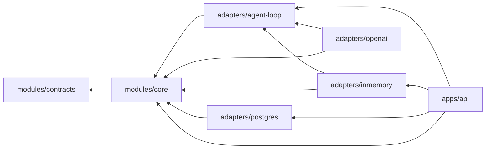

# Module Map

## 当前物理模块

```text
modules/contracts
  跨进程与跨参与者稳定契约、safe Trace、Result 与 HarnessRunBundle 完整性规则

modules/core
  domain       领域实体、值对象、状态机、不变量
  application  用例编排与 Agent 结果的确定性验收/提交
  port         对外能力端口，包括 provider-neutral AgentKernel

adapters/agent-loop
  framework-free 有限工具循环、provider-neutral Model/Tool SPI、固定工具注册表
  不依赖具体模型 SDK、Spring、数据库、Temporal 或其他 Agent Runtime

adapters/inmemory
  内存 Ledger、确定性草稿生成、Policy、Action Stub
  脚本 Fake Model 与 frozen synthetic Offline golden runner

adapters/postgres
  Capture、Artifact lineage、local Action 与 AgentRun 的 JdbcClient 适配器
  以及前向 Flyway migrations；V5 将 model execution binding 同时冻结在
  Task JSON 与 typed columns，并在读取时双向核验

adapters/openai
  OpenAI Java SDK 4.43.0 的 Responses protocol adapter；实现 strict tool、
  manual item replay、strict structured final、per-call reservation、usage/cost
  归因与 typed failure。只接受外部装配好的 client，不读取环境变量或凭据；
  当前只有 loopback contract tests，未接 API、Eval runner 或真实 provider

apps/api
  HTTP DTO、Controller、异常映射、loopback 启动保护、Agent draft 入口、
  owner-scoped Run/Trace/Bundle 查询、S3 模拟 Provider HTTP adapter、依赖装配
```

## 依赖规则



- `core` 不依赖 Spring、数据库、Temporal、AgentScope 或模型 SDK。
- `contracts` 不依赖任何实现模块。
- `agent-loop` 不依赖具体模型 SDK、Spring、数据库、Temporal 或上层 Agent Runtime。
- `openai` 不依赖 API、Spring、数据库、Temporal 或其他 Agent Runtime；SDK 类型不得
  越过 adapter boundary。
- Maven Enforcer 在 `core`、`contracts` 与 `agent-loop` 构建中阻止依赖越界。
- Adapter 只能实现 Core Port，不能让 SDK 类型进入 Core。
- API 负责传输协议，不能包含领域状态转移。
- 跨模块只交换显式类型与引用，不共享可变聊天上下文。

## 领域包的演化目标

代码量增长后，Core 内部按领域拆包，但暂不立即拆 Maven 模块：

| 领域 | 所有权 |
|---|---|
| capture | 低摩擦输入、去重、来源 |
| evidence | 只追加事件、血缘、保留策略 |
| selfmodel | 已确认认识、候选、冲突、Working Self |
| artifact | 版本、内容 Hash、来源与编辑 |
| policy | 风险、审批、Capability 和撤销 |
| action | Connector、幂等、Receipt 和对账 |
| reflection | 用户修改、结果反馈、候选晋升 |
| agent | Task 权限、结构化提案验收、Artifact 提交与 Result |
| verification | Readiness、Verifier、故障归因和回归 |

当一个领域拥有独立数据、不变量、维护者和发布节奏时，再将其提升为独立构建模块或服务。

## 当前与后续 Adapter

```text
adapters/agent-loop        # 已实现：provider-neutral、framework-free 有界 Loop 与 Tool SPI
adapters/inmemory/agent    # 已实现：脚本 Fake Model 与 Offline golden baseline
adapters/postgres          # 已实现：Capture、Artifact、local Action、AgentRun/Trace
adapters/openai            # 已实现 protocol adapter；等待独立 synthetic Eval runner 装配
adapters/object-storage
adapters/agent-agentscope
adapters/agent-pi
adapters/temporal
adapters/connectors/*
```

除已标记的通用 Agent Loop、OpenAI protocol adapter、in-memory Fake/Offline baseline 与
PostgreSQL 持久适配器外，其余都是计划，
不应在存在真实实现前创建空目录。S3 模拟 Provider 属于 API 外层的 test-only 协议，不代表
真实 Connector。OpenAI adapter 也没有普通产品 route、credential resolver 或 live receipt；
它当前只证明 loopback contract。当前 safe Trace 已持久化并与 owner-scoped AgentRun、Result、Artifact
version 和 HarnessRunBundle 绑定；它不是原始模型 transcript。
