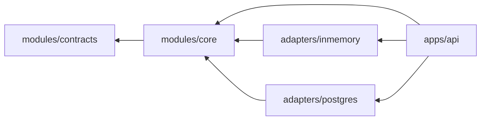

# Module Map

## 当前物理模块

```text
modules/contracts
  跨进程与跨参与者稳定契约

modules/core
  domain       领域实体、值对象、状态机、不变量
  application  用例编排与 Agent 结果的确定性验收/提交
  port         对外能力端口，包括 provider-neutral AgentKernel

adapters/inmemory
  内存 Ledger、确定性草稿生成、Policy、Action Stub
  framework-free 有限工具循环、脚本 Fake Model、工具注册表与 capture.read

adapters/postgres
  S1 Capture、S2 Artifact lineage、S3 local Action 的 JdbcClient 适配器与前向 Flyway migrations

apps/api
  HTTP DTO、Controller、异常映射、loopback 启动保护、Agent draft 入口、
  S3 模拟 Provider HTTP adapter、依赖装配
```

## 依赖规则



- `core` 不依赖 Spring、数据库、Temporal、AgentScope 或模型 SDK。
- `contracts` 不依赖任何实现模块。
- Maven Enforcer 在 `core` 与 `contracts` 构建中阻止框架、数据库和模型 SDK 越界。
- Adapter 只能实现 Core Port，不能让 SDK 类型进入 Core。
- API 负责传输协议，不能包含领域状态转移。
- 跨模块只交换显式类型与引用，不共享可变聊天上下文。

## 领域包的演化目标

代码量增长后，Core 内部按领域拆包，但暂不立即拆 Maven 模块：

| 领域 | 所有权 |
|---|---|
| capture | 低摩擦输入、去重、来源 |
| evidence | 只追加事件、血缘、保留策略 |
| selfmodel | 已确认认识、候选、冲突、Working Self |
| artifact | 版本、内容 Hash、来源与编辑 |
| policy | 风险、审批、Capability 和撤销 |
| action | Connector、幂等、Receipt 和对账 |
| reflection | 用户修改、结果反馈、候选晋升 |
| agent | Task 权限、结构化提案验收、Artifact 提交与 Result |
| verification | Readiness、Verifier、故障归因和回归 |

当一个领域拥有独立数据、不变量、维护者和发布节奏时，再将其提升为独立构建模块或服务。

## 当前与后续 Adapter

```text
adapters/inmemory/agent    # 已实现：有界 Fake Agent 基线，不含真实模型 SDK
adapters/postgres            # 已实现：S1 Capture、S2 Artifact lineage、S3 local Action
adapters/object-storage
adapters/agent-agentscope
adapters/agent-pi
adapters/temporal
adapters/connectors/*
```

除已标记的 in-memory Agent 基线与 PostgreSQL Capture/Artifact/local Action 适配器外，其余
都是计划，不应在存在真实实现前创建空目录。S3 模拟 Provider 属于 API 外层的 test-only
协议，不代表真实 Connector。S1 Agent Trace 只投影到当前 HTTP 响应，尚无持久化 run/Trace
绑定。
