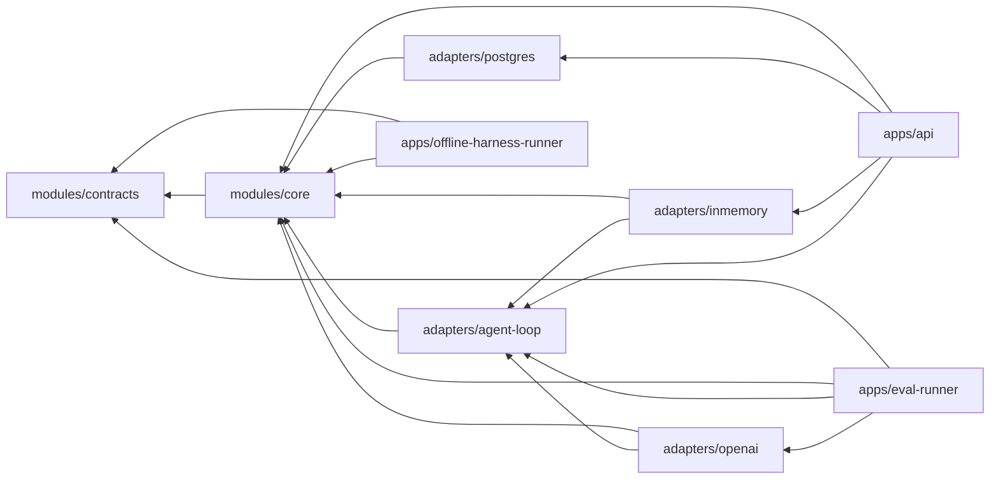

# Module Map

## 当前物理模块

```text
modules/contracts
  跨进程与跨参与者稳定契约、safe Trace、Result 与 HarnessRunBundle 完整性规则

modules/core
  domain       领域实体、值对象、状态机、不变量
  application  用例编排与 Agent 结果的确定性验收/提交
  port         对外能力端口，包括 provider-neutral AgentKernel

adapters/agent-loop
  framework-free 有限工具循环、provider-neutral Model/Tool SPI、固定工具注册表
  不依赖具体模型 SDK、Spring、数据库、Temporal 或其他 Agent Runtime

adapters/inmemory
  内存 Ledger、确定性草稿生成、Policy、Action Stub
  脚本 Fake Model 与 frozen synthetic Offline golden runner

adapters/postgres
  Capture、Artifact lineage、local Action 与 AgentRun 的 JdbcClient 适配器
  以及前向 Flyway migrations；V5 将 model execution binding 同时冻结在
  Task JSON 与 typed columns，并在读取时双向核验

adapters/openai
  OpenAI Java SDK 4.43.0 的 Responses protocol adapter；实现 strict tool、
  manual item replay、strict structured final、per-call reservation、usage/cost
  归因与 typed failure。只接受外部装配好的 client，不读取环境变量或凭据；
  当前已由 isolated Eval Runner 装配，但未接普通 API，也没有 live-provider receipt

apps/eval-runner
  独立 packaged synthetic Eval 入口；依赖 contracts、core、agent-loop 与 openai
  默认只做 zero-egress preflight；live 路径需要 real TTY、exact Task-bound
  one-shot permit、POSIX attempt marker/journal 与本地 atomic terminal run record
  不依赖 API、PostgreSQL、Spring、Temporal、产品 Store 或真实用户数据

apps/offline-harness-runner
  独立 deterministic Harness comparison 边界；只依赖 contracts、core 与 Jackson
  当前只从固定仓库路径严格加载 hash-frozen Pack 004，验证完整 synthetic provenance、
  单变量 arms/cases/matrix，并用依赖 allowlist 与 production bytecode gate 阻止
  model、network、process、Connector、DB 和产品 Store 路径；尚未执行 comparison

apps/api
  HTTP DTO、Controller、异常映射、loopback 启动保护、Agent draft 入口、
  owner-scoped Run/Trace/Bundle 查询、S3 模拟 Provider HTTP adapter、依赖装配
```

## 依赖规则



- `core` 不依赖 Spring、数据库、Temporal、AgentScope 或模型 SDK。
- `contracts` 不依赖任何实现模块。
- `agent-loop` 不依赖具体模型 SDK、Spring、数据库、Temporal 或上层 Agent Runtime。
- `openai` 不依赖 API、Spring、数据库、Temporal 或其他 Agent Runtime；SDK 类型不得
  越过 adapter boundary。
- `eval-runner` 不依赖 API、PostgreSQL、in-memory 产品 Adapter、Spring、Temporal
  或上层 Agent Runtime；它不能成为普通产品 route。
- `offline-harness-runner` 使用 default-deny dependency allowlist，只允许
  contracts、core、Jackson 与 test-only JUnit；它不依赖任何 Adapter、API、模型 SDK、
  HTTP client 或数据库，并扫描允许 production closure 的已编译 JDK network/process
  references。该扫描是 fail-closed architecture gate，不是 OS sandbox 或 packet capture。
- Maven Enforcer 在 `core`、`contracts` 与 `agent-loop` 构建中阻止依赖越界。
- Adapter 只能实现 Core Port，不能让 SDK 类型进入 Core。
- API 负责传输协议，不能包含领域状态转移。
- 跨模块只交换显式类型与引用，不共享可变聊天上下文。

## 领域包的演化目标

代码量增长后，Core 内部按领域拆包，但暂不立即拆 Maven 模块：

| 领域 | 所有权 |
|---|---|
| capture | 低摩擦输入、去重、来源 |
| evidence | 只追加事件、血缘、保留策略 |
| selfmodel | 已确认认识、候选、冲突、Working Self |
| artifact | 版本、内容 Hash、来源与编辑 |
| policy | 风险、审批、Capability 和撤销 |
| action | Connector、幂等、Receipt 和对账 |
| reflection | 用户修改、结果反馈、候选晋升 |
| agent | Task 权限、结构化提案验收、Artifact 提交与 Result |
| verification | Readiness、Verifier、故障归因和回归 |

当一个领域拥有独立数据、不变量、维护者和发布节奏时，再将其提升为独立构建模块或服务。

## 当前与后续 Adapter

```text
adapters/agent-loop        # 已实现：provider-neutral、framework-free 有界 Loop 与 Tool SPI
adapters/inmemory/agent    # 已实现：脚本 Fake Model 与 Offline golden baseline
adapters/postgres          # 已实现：Capture、Artifact、local Action、AgentRun/Trace
adapters/openai            # 已实现 protocol adapter；只由独立 synthetic Eval runner 装配
adapters/object-storage
adapters/agent-agentscope
adapters/agent-pi
adapters/temporal
adapters/connectors/*
```

除已标记的通用 Agent Loop、OpenAI protocol adapter、isolated Eval Runner、
in-memory Fake/Offline baseline 与 PostgreSQL 持久适配器外，其余都是计划，
不应在存在真实实现前创建空目录。S3 模拟 Provider 属于 API 外层的 test-only 协议，不代表
真实 Connector。OpenAI adapter 没有普通产品 route 或 product credential resolver；
Eval Runner 的 engineering-complete 声明以当前最终验证通过为条件，且当前没有读取 real
key、访问 live provider、产生 real model result 或 billing receipt。当前 safe Trace 已
持久化并与 owner-scoped AgentRun、Result、Artifact version 和 HarnessRunBundle 绑定；
它不是原始模型 transcript。

## Isolated Eval Runner 的本地边界

- one-shot 只在当前 POSIX host 与当前 owner home 内成立，不是跨主机分布式锁或
  provider-side idempotency key；
- marker 在 challenge 前用 `CREATE_NEW` 创建；错误 challenge 也会烧掉这次 attempt，
  credential 只能在 permit 之后读取一次；
- 私有目录必须是 `0700`、文件必须是 `0600`，并拒绝 symlink、foreign owner 与
  foreign allow ACL；
- attempt journal 在 credential read、client creation、provider SDK create intent 与
  terminal record publish 周围 append + `fsync` hash-chain event；
- terminal run record 通过私有 `.pending` 文件、read-back、`ATOMIC_MOVE` 与目录
  `fsync` 发布；这是本地 atomic publish，不与 provider 调用形成一个 transaction，
  也不替代 PostgreSQL product `AgentRun`；
- 同 UID 恶意进程、owner/root 删除或重写文件、换主机重放、签名、WORM 与 invoice
  reconciliation 都不在该 Gate 的保护范围内；
- provider invocation 已可能发生但 usage 未完整归因时必须记为
  `billingStatus=UNKNOWN`。此时 `observedCostUsd=0` 只表示未观测，不能解释成免费；
  reservation 是调用前 authorization ceiling，provider 返回的 observed usage 即使超过
  reservation 也必须保留。
