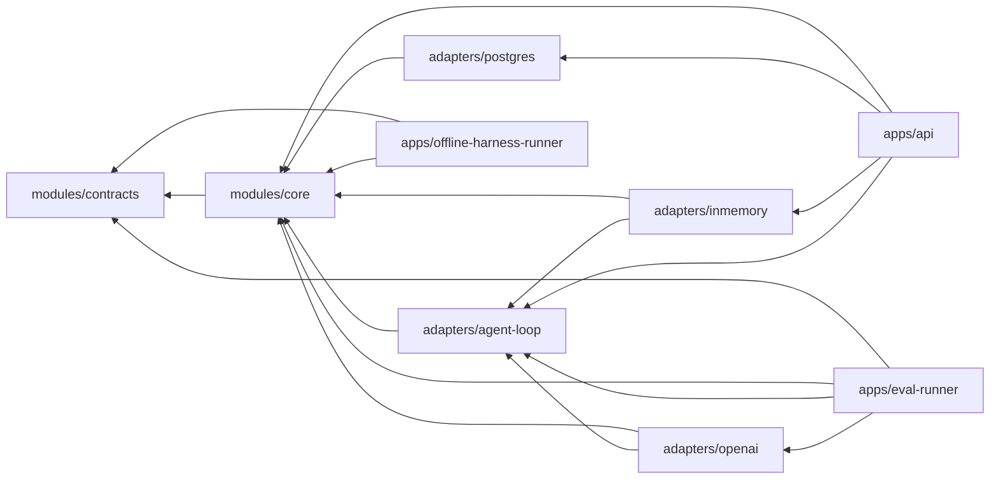

# Module Map

## 当前物理模块

```text
modules/contracts
  跨进程与跨参与者稳定契约、safe Trace、Result 与 HarnessRunBundle 完整性规则

modules/core
  domain       领域实体、值对象、状态机、不变量
  application  用例编排与 Agent 结果的确定性验收/提交
  port         对外能力端口，包括 provider-neutral AgentKernel

adapters/agent-loop
  framework-free 有限工具循环、provider-neutral Model/Tool SPI、版本化固定工具注册表
  Model 只交付 bounded/immutable/redacted raw arguments；Tool 先做纯 validation，
  生成 typed arguments 后才允许一次性 execute
  不依赖具体模型 SDK、Spring、数据库、Temporal 或其他 Agent Runtime

adapters/inmemory
  内存 Ledger、确定性草稿生成、Policy、Action Stub
  脚本 Fake Model 与 frozen synthetic Offline golden runner

adapters/postgres
  Capture、Artifact lineage、local Action 与 AgentRun 的 JdbcClient 适配器
  以及前向 Flyway migrations；V5 将 model execution binding 同时冻结在
  Task JSON 与 typed columns，并在读取时双向核验

adapters/openai
  OpenAI Java SDK 4.43.0 的 Responses protocol adapter；实现 strict tool、
  manual item replay、strict structured final、per-call reservation、usage/cost
  归因与 typed failure。只接受外部装配好的 client，不读取环境变量或凭据；
  当前已由 isolated Eval Runner 装配，但未接普通 API，也没有 live-provider receipt

apps/eval-runner
  独立 packaged synthetic Eval 入口；依赖 contracts、core、agent-loop 与 openai
  默认只做 zero-egress preflight；live 路径需要 real TTY、exact Task-bound
  one-shot permit、POSIX attempt marker/journal 与本地 hard-link create-only terminal
  run record
  不依赖 API、PostgreSQL、Spring、Temporal、产品 Store 或真实用户数据

apps/offline-harness-runner
  独立 deterministic Harness comparison 边界；只依赖 contracts、core 与 Jackson
  从固定仓库路径严格加载 hash-frozen Pack 004，生成 12 个 shared candidates，
  执行 24 次 H0/H1 VerifierEvaluation，并由不引用 Runner/generator 的独立 verifier
  重建、重放和重算 report；canonical codec、owner-local POSIX store、packaged
  `--execute/--verify` 与 hard-link create-only commit 提供 fresh-JVM durable
  verification；依赖 allowlist 与 production bytecode gate 阻止 model、network、
  process、Connector、DB 和产品 Agent Runtime/Store 路径

apps/api
  HTTP DTO、Controller、异常映射、loopback 启动保护、Agent draft 入口、
  owner-scoped Run/Trace/Bundle 查询、S3 模拟 Provider HTTP adapter、依赖装配
```

## 依赖规则



- `core` 不依赖 Spring、数据库、Temporal、AgentScope 或模型 SDK。
- `contracts` 不依赖任何实现模块。
- `agent-loop` 不依赖具体模型 SDK、Spring、数据库、Temporal 或上层 Agent Runtime。
- 当前 `agent-tools-v2` manifest 精确绑定
  `capture.read → urn:emergeos:tool:capture-read-arguments:v1`；缺失、额外 Tool 或
  schema drift 都在打开 Model session 前 fail fast。Task 的 server-owned allowlist
  仍是第二层权限，manifest 不能替代 Task authority。
- `openai` 不依赖 API、Spring、数据库、Temporal 或其他 Agent Runtime；SDK 类型不得
  越过 adapter boundary。
- `eval-runner` 不依赖 API、PostgreSQL、in-memory 产品 Adapter、Spring、Temporal
  或上层 Agent Runtime；它不能成为普通产品 route。
- `offline-harness-runner` 使用 default-deny dependency allowlist，只允许
  contracts、core、Jackson 与 test-only JUnit；它不依赖任何 Adapter、API、模型 SDK、
  HTTP client 或数据库，并扫描允许 production closure 的已编译 JDK network/process
  references。本模块 production classes 另有 product-runtime denylist，只放行 H1 facade
  与最小 domain types；independent verifier 的 outer/nested classes 不得引用 Runner 或
  generator。以上扫描是 fail-closed architecture evidence，不是 OS sandbox、历史执行
  attestation 或 packet capture。
- Maven Enforcer 在 `core`、`contracts` 与 `agent-loop` 构建中阻止依赖越界。
- Adapter 只能实现 Core Port，不能让 SDK 类型进入 Core。
- API 负责传输协议，不能包含领域状态转移。
- 跨模块只交换显式类型与引用，不共享可变聊天上下文。

### Tool arguments 与 dispatch 边界

Provider adapter 不再替具体 Tool 解释 arguments。它只保留最多 65,536 UTF-8 bytes 的
opaque raw arguments；载体 immutable，`toString()` 永远 redacted。`capture.read`
在 Tool-owned validation 阶段使用 Jackson 3.1.4 strict parser，额外收紧到 1,024 bytes，
拒绝 duplicate keys、trailing tokens、unknown/missing/wrong-type 字段与非 canonical
Capture ref。只有 validation 返回 immutable typed arguments，registry 又确认该 ref
属于 Task inputs 后，才生成一次性 `PreparedToolExecution`。

未注册或未被 Task 声明的 Tool 会在 validation 前直接 `BLOCKED`。只有同时
registered 且被 `requiredTools` 声明的 call 才进入 Tool-owned validation；registry
完成 input-ref authority 检查后，Kernel 会在接受 rejection 或写入
`TOOL_REQUEST` 前重新检查 cancellation/deadline。这个 cooperative check 不是与后续
同步 `execute` 原子化的强制中断。schema-invalid 路径只形成安全的
`TOOL_REJECTED`，不会把 raw arguments 或字段名写入 Result、Trace 或 Bundle。当前
Tool implementation 属于 Trusted TCB：接口约定 `validate` 无副作用，manifest 只绑定
name/schema，尚未绑定实现制品身份。引入第三方 Tool 前必须增加 implementation
identity、信任策略与验证参数不可变约束。当前 Tool limit 在 validation 之后判定，
`invalid + over-limit` 的 precedence 尚未作为独立 fault pack 冻结。

### Offline Harness Runner 的 durable report 边界

`offline-harness-runner` 的 storage 只承载 frozen PUBLIC synthetic Pack 004 report：

```text
canonical report
  → CREATE_NEW claim
  → pending write/read-back/fsync
  → hard-link create-only target
  → directory fsync
  → pending unlink
  → fresh-JVM read-only replay
```

pending 从不 authoritative。claim-only 或 claim+pending/no-target 是 `UNKNOWN`；
pending 无 claim 是 `INVALID`。target+pending 只有在二者是同一 regular inode 时才是
合法 committed residue；不同 inode、unexpected entry、unsafe metadata 或 invalid
authoritative target bytes 一律 `INVALID`。Reader 不 repair、不 unlink、不 rewrite。

它与 `eval-runner` 的 one-shot marker/journal/run record 不是同一 persistence
protocol，也不替代 PostgreSQL product `AgentRun`。当前证据只覆盖 tested local POSIX
filesystem 上的 cooperative writer 与选定 process-kill phase，不覆盖 power-loss、
NFS、same-UID/root adversary 或 hidden ACL。路径没有 `dirfd/openat` anchoring，
hash/replay 也不是 signature、producer attestation 或 WORM。

## 领域包的演化目标

代码量增长后，Core 内部按领域拆包，但暂不立即拆 Maven 模块：

| 领域 | 所有权 |
|---|---|
| capture | 低摩擦输入、去重、来源 |
| evidence | 只追加事件、血缘、保留策略 |
| selfmodel | 已确认认识、候选、冲突、Working Self |
| artifact | 版本、内容 Hash、来源与编辑 |
| policy | 风险、审批、Capability 和撤销 |
| action | Connector、幂等、Receipt 和对账 |
| reflection | 用户修改、结果反馈、候选晋升 |
| agent | Task 权限、结构化提案验收、Artifact 提交与 Result |
| verification | Readiness、Verifier、故障归因和回归 |

当一个领域拥有独立数据、不变量、维护者和发布节奏时，再将其提升为独立构建模块或服务。

## 当前与后续 Adapter

```text
adapters/agent-loop        # 已实现：provider-neutral、framework-free 有界 Loop 与 Tool SPI
adapters/inmemory/agent    # 已实现：脚本 Fake Model 与 Offline golden baseline
adapters/postgres          # 已实现：Capture、Artifact、local Action、AgentRun/Trace
adapters/openai            # 已实现 protocol adapter；只由独立 synthetic Eval runner 装配
adapters/object-storage
adapters/agent-agentscope
adapters/agent-pi
adapters/temporal
adapters/connectors/*
```

除已标记的通用 Agent Loop、OpenAI protocol adapter、isolated Eval Runner、
in-memory Fake/Offline baseline 与 PostgreSQL 持久适配器外，其余都是计划，
不应在存在真实实现前创建空目录。S3 模拟 Provider 属于 API 外层的 test-only 协议，不代表
真实 Connector。OpenAI adapter 没有普通产品 route 或 product credential resolver；
Eval Runner 的 engineering-complete 声明以当前最终验证通过为条件，且当前没有读取 real
key、访问 live provider、产生 real model result 或 billing receipt。当前 safe Trace 已
持久化并与 owner-scoped AgentRun、Result、Artifact version 和 HarnessRunBundle 绑定；
它不是原始模型 transcript。

## Isolated Eval Runner 的本地边界

- one-shot 只在当前 POSIX host 与当前 owner home 内成立，不是跨主机分布式锁或
  provider-side idempotency key；
- marker 在 challenge 前用 `CREATE_NEW` 创建；错误 challenge 也会烧掉这次 attempt，
  credential 只能在 permit 之后读取一次；
- 私有目录必须是 `0700`、文件必须是 `0600`，并拒绝 symlink、foreign owner 与
  filesystem provider 可见的 foreign allow ACL；当前 macOS JDK 不暴露 ACL view，
  因而这不是 hostile-local-user authorization；
- attempt journal 在 credential read、client creation、provider SDK create intent 与
  terminal record publish 周围 append + `fsync` hash-chain event；
- terminal run record 通过私有 `.pending` 的 `CREATE_NEW` write、file/read-back/
  directory `fsync`，再以 `createLink(target, pending)` 做 create-only logical
  commit；commit directory `fsync` 后清理 pending、再次 `fsync` 并重验 target；
- precheck 后出现的 target 不会被覆盖；hard link 不支持时 fail closed，不降级为
  move。pending-only 不 authoritative；同 inode target+pending 是 committed cleanup
  residue，不同 inode 是 `INVALID`。它不与 provider 调用形成 transaction，也不替代
  PostgreSQL product `AgentRun`；
- 同 UID 恶意进程、owner/root 删除或重写文件、换主机重放、签名、WORM 与 invoice
  reconciliation 都不在该 Gate 的保护范围内；
- provider invocation 已可能发生但 usage 未完整归因时必须记为
  `billingStatus=UNKNOWN`。此时 `observedCostUsd=0` 只表示未观测，不能解释成免费；
  reservation 是调用前 authorization ceiling，provider 返回的 observed usage 即使超过
  reservation 也必须保留。
