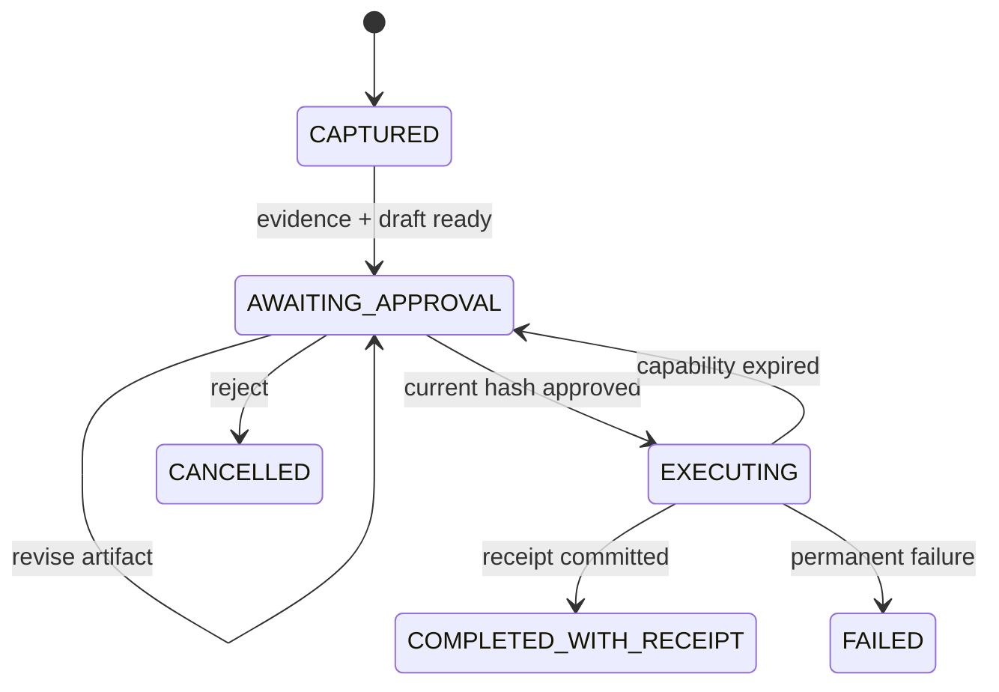

# Runtime, State and Receipts

## 三类状态必须分开

| 状态 | 例子 | 真相位置 |
|---|---|---|
| 领域真相 | Evidence、Self Model、Artifact、Approval、Receipt | PostgreSQL / Object Storage |
| 运行状态 | 当前步骤、重试、等待、Child Workflow | Durable Runtime |
| 模型上下文 | Working Self、工具结果、摘要 | 可重建临时投影 |

模型上下文丢失不应导致人格或任务真相丢失；Durable Runtime 也不能成为用户人格数据库。

## 关键不变量

1. 没有 Evidence，不能生成 Artifact。
2. Artifact 修改必须创建新版本和 Hash。
3. Approval 必须绑定 ActionPlan Hash 与当前 Artifact Hash。
4. Artifact 修改后，旧 Approval 与 Capability 立即失效。
5. 外部动作必须有幂等键；同一键只能对应一个外部结果。
6. 没有成功 Receipt，不能显示“已完成”。
7. ReflectionCandidate 未确认前不能进入下一次 Working Self。

## 状态机



反思是独立轴。反思失败不能把已经有 Receipt 的行动改成失败。

## Durable Runtime 边界

Temporal 只承载粗粒度、需要可靠性的流程：

- 等待审批、定时和外部回调；
- 模型、搜索、渲染和平台 API Activity；
- 重试、超时、补偿和 Child Workflow；
- 外部副作用的幂等与对账。

它不记录每个 token，也不替代 Evidence Ledger、Self Model、Artifact Store 或 Receipt Ledger。

## 交接契约

Agent、工具与人类之间的 Handoff 至少携带：

```text
principalRef
delegationChain
intent
constraints
policyVersion
stateVersion
toolRegistryVersion
environmentSnapshotRef
capabilityRefs
artifactRefs
evidenceRefs
budget
risk
unresolvedDecisions
returnControlWhen
traceRef
```

不传输隐藏思维链。

