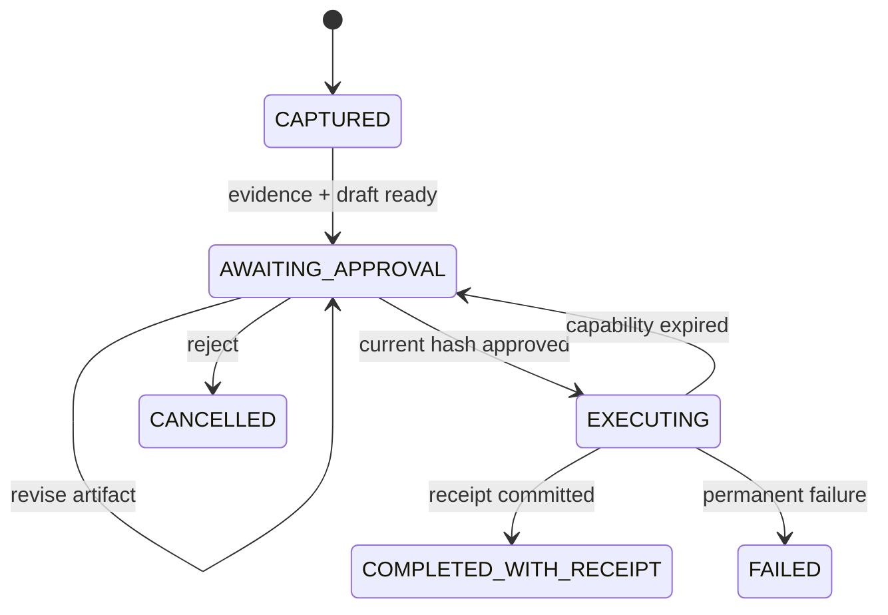
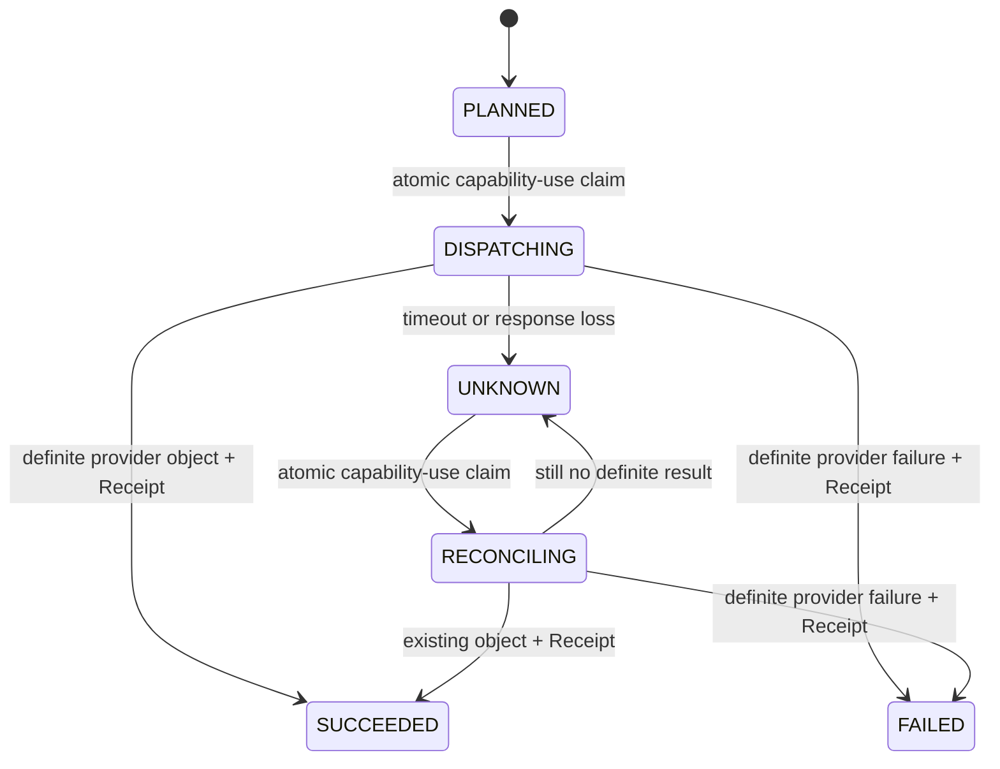

# Runtime, State and Receipts

## 三类状态必须分开

| 状态 | 例子 | 真相位置 |
|---|---|---|
| 领域真相 | Evidence、Self Model、Artifact、Approval、Receipt | PostgreSQL / Object Storage |
| 产品执行证据 | Task、terminal Result、safe Trace、WorkerResult、typed cross-run binding、HarnessRunBundle | PostgreSQL |
| 运行状态 | 当前步骤、重试、等待、Child Workflow | Durable Runtime |
| 模型上下文 | Working Self、工具结果、摘要 | 可重建临时投影 |

模型上下文丢失不应导致人格或任务真相丢失；Durable Runtime 也不能成为用户人格数据库。
Stage 2 S2 中持久化的 `RUNNING` AgentRun 只证明一次运行已经开始但尚无 terminal
事实；它不是 durable checkpoint，也不承诺从中间步骤 resume。安全恢复策略必须在
后续 Runtime 切片中以新契约实现。

Pack007 允许 child terminal transaction 先于 parent terminal transaction 提交：

```text
child = terminal + verified WorkerResult
parent = RUNNING
parent Trace/HANDOFF/Artifact = 0
```

这个 crash gap 是可解释的 durable truth，不是 checkpoint。fresh JVM 可以只读验证
child 与 incomplete parent，但系统不会自动 resume、retry 或制造 parent completion。

Pack008 沿用同一 V6 truth shape，但把 model route 只绑定到 child。durable reader
不能按“当前 Worker”解释历史数据：

```text
RUNNING parent/child
  → complete Task graph 必须恰好匹配一个 registered profile

terminal parent/child
  → Bundle 必须命名 exact registry + profile fingerprint
  → experiment / Harness / component map exact match
  → parent 与 child 必须解析为同一个 profile instance
```

当前 Pack008 evidence 只证明 same-JVM fresh Store 可以读取 child-terminal /
parent-`RUNNING` gap并由新 Store instance 完成 parent；它没有 Pack008 fresh-JVM、
process-kill、lease、checkpoint 或自动 resume。test-only process-local graph permit
也不是 Durable Runtime state，崩溃后不能用它判断 provider 是否已调用。

Pack009以 PostgreSQL V7把一个 fixed synthetic graph attempt的 claim、Run/profile
binding、journal与 CAS head放进同一 durable authority。它选择并证明的 crash truth是：

```text
PROVIDER_INTENT durable + loopback provider accepted exactly one request
writer killed before provider attribution
→ evidence = VALID
→ graph = INCOMPLETE
→ billing = UNKNOWN
→ same execution slot cannot replay
```

两个 fresh verifier JVM从同一 `READ ONLY REPEATABLE READ` snapshot重算 manifest、
selection、journal、Run与 seal truth；reader不 repair、resume或改写。完整 writer
replay仍读取 DB password以访问该 authority，但在 provider credential/client/request
前因 create-only claim冲突退出。`UNKNOWN`不等于免费、未调用或可 retry。
`agent_graph_attempt_seals`当前以 `CHECK(FALSE)`禁用，只是未来 terminal transaction的
schema skeleton；Pack009没有 checkpoint、terminal graph、reconciliation、lease或
provider-side idempotency。

### read-only Worker 的 observation precedence

Worker dispatch 返回后，Kernel 先验证 child identity 与 usage domain；不可信值直接
`FAILED / UNSAFE_HANDOFF_OUTCOME`。可信 observation 按下列顺序决定 parent truth：

```text
aggregate subtree budget
→ strict post-child deadline
→ verified child terminal status
→ accept successful WorkerResult
→ post-success cooperative cancellation
→ exact-deadline exhaustion before next Model step
```

因此 over-budget observation 不能被 deadline 或 cancellation 掩盖；budget 内的
strict late completion 胜过 cancellation/child failure；deadline 内的 verified child
non-success 胜过 cancellation。成功 child 被接受后若观察到 cancellation，parent
成为 `CANCELLED`，但已提交 child observation 不被改写。runtime 抛错且没有可信 child
observation 时才采用 strict deadline → cancellation → dispatch failure。

### Agent Loop 的 cooperative deadline truth

当前 `AgentLoopKernel` 在 process 内同步执行 trusted read-only Tool，不使用 hard
preemption。deadline 是 success acceptance boundary，而不是 non-success
observation 的截断器：

```text
pre-operation:
  remaining <= 0 → 不启动下一步，DEADLINE_EXHAUSTED

post-execute:
  elapsed > deadline → TOOL_DEADLINE_EXCEEDED_AFTER_DISPATCH
  elapsed == deadline → 可接受合法 Tool Result，下一 boundary 再 exhausted
```

post-execute 同时观察到 late completion 与 cancellation 时，typed deadline 是
canonical attribution；这不否认 cancellation 发生。若结果 within deadline 且只有
cancellation，则保留已经验证的 Tool Result/Evidence，并在下一 Model 前
`CANCELLED`。该 post-result boundary 在最后一个允许的 Model step 后仍然存在，必须
先于 loop exhaustion 判定。两种 terminal 路径都不能再产生 Model、Tool 或 Artifact。

terminal Result、AgentRun、safe Trace 与 HarnessRunBundle 使用同一 shared policy；
PostgreSQL 持久化 actual latency，不做 clamp。该 truth 只覆盖当前 read-only registry，
不提供 mid-step resume 或 write-side exactly-once。write-capable Tool timeout 仍必须
进入 durable `UNKNOWN + reconciliation`，再由 Runtime 编排对账。

## 关键不变量

1. 没有 Evidence，不能生成 Artifact。
2. Artifact 修改必须创建新版本和 Hash。
3. Approval 必须绑定 ActionPlan Hash 与当前 Artifact Hash。
4. Artifact 修改后，旧 Approval 与 Capability 立即失效。
5. 外部动作必须有幂等键；同一键只能对应一个外部结果。
6. 没有成功 Receipt，不能显示“已完成”。
7. ReflectionCandidate 未确认前不能进入下一次 Working Self。
8. Pack007 read-only Worker 只能读取 parent 已授权的同一个 owner-scoped Capture，
   不能写 Artifact、Action、Receipt、Checkpoint 或再次 Handoff。
9. parent 只能消费 terminal、same-owner、exact Task/profile/hash-bound child；
   parent 仍是唯一 Artifact writer。

## 状态机



反思是独立轴。反思失败不能把已经有 Receipt 的行动改成失败。

### S3 durable local Action 状态



S3 中 `ActionAttempt`、不可变 transition、Capability 调用预算和 Receipt 由 PostgreSQL 持有。
Provider 调用发生在 claim 事务提交之后；`SUCCEEDED/FAILED`、最后一条 transition 与 Receipt
同事务提交。`UNKNOWN` 没有 Receipt，也不能显示为完成。测试用 Fake Provider 在独立 JVM 与
独立文件中持有模拟对象；这不是 Temporal，也不是生产 Connector。

S4 readiness 只读取 server-configured principal 的六种 Action 状态：
`PLANNED/DISPATCHING/UNKNOWN/RECONCILING` 都使 durable readiness
`OUT_OF_SERVICE`，但不改变 process liveness。`UNKNOWN` 有显式 reconcile 入口；
`DISPATCHING` 与 `RECONCILING` 没有安全 stale-claim 接管。特别是 provider 已成功、但进程在
本地 outcome/Receipt commit 前死亡时，数据库可能停在 `DISPATCHING`。当前没有
PostgreSQL-canonical owner/lease/fencing 机制，不能用时间阈值重置；ADR-0004 保持 Proposed，
真实 Connector Gate 保持关闭。

## Durable Runtime 边界

Temporal 只承载粗粒度、需要可靠性的流程：

- 等待审批、定时和外部回调；
- 模型、搜索、渲染和平台 API Activity；
- 重试、超时、补偿和 Child Workflow；
- 外部副作用的幂等与对账。

它不记录每个 token，也不替代 Evidence Ledger、Self Model、Artifact Store 或 Receipt Ledger。
S3 已在不引入 Temporal 的前提下证明数据库 ActionAttempt + provider reconciliation 的最小
真相边界；后续 Runtime 只能编排这条边界，不能绕开其唯一约束、预算或 Receipt 原子性。
Pack007 同样没有引入 Temporal；`AgentWorkerRuntime` 只是一个 synchronous、
provider-neutral port，V6 PostgreSQL 持有 child/result/relation 真相。未来 Durable
Runtime 可以编排等待、resume 与 retry，但不能绕开 V6 same-owner、single-use、
terminal-child 与 parent atomic commit 约束。Pack009的 V7 one-shot slot、durable
provider intent与 `UNKNOWN`同样是未来 Runtime必须服从的 truth；Temporal不能删除
claim、把 `UNKNOWN`改成 `NOT_INVOKED`或自动重放 provider request。

## 交接契约

Pack007 已实现的最小 typed 子集是：

```text
parent Task + parent Run
→ delegationChain depth=1
→ inherited policy/state/context/tool registry/environment
→ server-owned Worker profile fingerprint
→ child Task + child Run
→ WorkerResultEnvelope
→ child WORKER_RESULT binding
→ parent HANDOFF binding
→ parent-only Artifact
```

更一般的 Agent、工具与人类 Handoff 至少携带：

```text
principalRef
delegationChain
intent
constraints
policyVersion
stateVersion
toolRegistryVersion
environmentSnapshotRef
capabilityRefs
artifactRefs
evidenceRefs
budget
risk
unresolvedDecisions
returnControlWhen
traceRef
```

不传输隐藏思维链。
