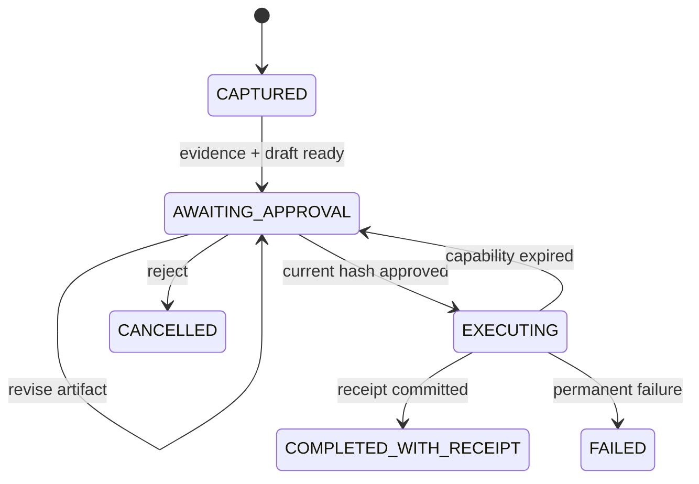
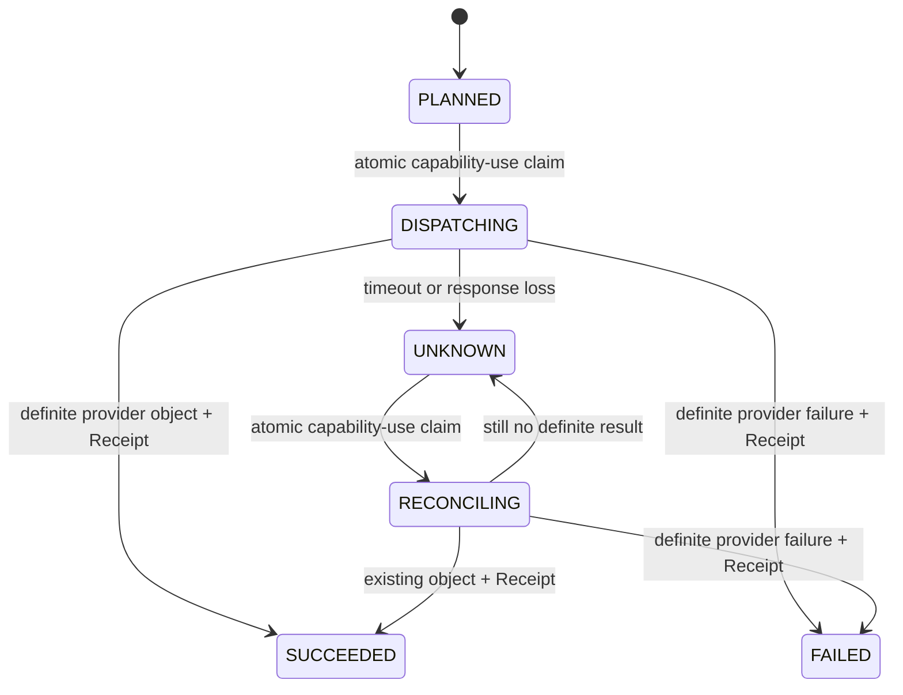

# Runtime, State and Receipts

## 三类状态必须分开

| 状态 | 例子 | 真相位置 |
|---|---|---|
| 领域真相 | Evidence、Self Model、Artifact、Approval、Receipt | PostgreSQL / Object Storage |
| 产品执行证据 | Task、terminal Result、safe Trace、resource binding、HarnessRunBundle | PostgreSQL |
| 运行状态 | 当前步骤、重试、等待、Child Workflow | Durable Runtime |
| 模型上下文 | Working Self、工具结果、摘要 | 可重建临时投影 |

模型上下文丢失不应导致人格或任务真相丢失；Durable Runtime 也不能成为用户人格数据库。
Stage 2 S2 中持久化的 `RUNNING` AgentRun 只证明一次运行已经开始但尚无 terminal
事实；它不是 durable checkpoint，也不承诺从中间步骤 resume。安全恢复策略必须在
后续 Runtime 切片中以新契约实现。

## 关键不变量

1. 没有 Evidence，不能生成 Artifact。
2. Artifact 修改必须创建新版本和 Hash。
3. Approval 必须绑定 ActionPlan Hash 与当前 Artifact Hash。
4. Artifact 修改后，旧 Approval 与 Capability 立即失效。
5. 外部动作必须有幂等键；同一键只能对应一个外部结果。
6. 没有成功 Receipt，不能显示“已完成”。
7. ReflectionCandidate 未确认前不能进入下一次 Working Self。

## 状态机



反思是独立轴。反思失败不能把已经有 Receipt 的行动改成失败。

### S3 durable local Action 状态



S3 中 `ActionAttempt`、不可变 transition、Capability 调用预算和 Receipt 由 PostgreSQL 持有。
Provider 调用发生在 claim 事务提交之后；`SUCCEEDED/FAILED`、最后一条 transition 与 Receipt
同事务提交。`UNKNOWN` 没有 Receipt，也不能显示为完成。测试用 Fake Provider 在独立 JVM 与
独立文件中持有模拟对象；这不是 Temporal，也不是生产 Connector。

S4 readiness 只读取 server-configured principal 的六种 Action 状态：
`PLANNED/DISPATCHING/UNKNOWN/RECONCILING` 都使 durable readiness
`OUT_OF_SERVICE`，但不改变 process liveness。`UNKNOWN` 有显式 reconcile 入口；
`DISPATCHING` 与 `RECONCILING` 没有安全 stale-claim 接管。特别是 provider 已成功、但进程在
本地 outcome/Receipt commit 前死亡时，数据库可能停在 `DISPATCHING`。当前没有
PostgreSQL-canonical owner/lease/fencing 机制，不能用时间阈值重置；ADR-0004 保持 Proposed，
真实 Connector Gate 保持关闭。

## Durable Runtime 边界

Temporal 只承载粗粒度、需要可靠性的流程：

- 等待审批、定时和外部回调；
- 模型、搜索、渲染和平台 API Activity；
- 重试、超时、补偿和 Child Workflow；
- 外部副作用的幂等与对账。

它不记录每个 token，也不替代 Evidence Ledger、Self Model、Artifact Store 或 Receipt Ledger。
S3 已在不引入 Temporal 的前提下证明数据库 ActionAttempt + provider reconciliation 的最小
真相边界；后续 Runtime 只能编排这条边界，不能绕开其唯一约束、预算或 Receipt 原子性。

## 交接契约

Agent、工具与人类之间的 Handoff 至少携带：

```text
principalRef
delegationChain
intent
constraints
policyVersion
stateVersion
toolRegistryVersion
environmentSnapshotRef
capabilityRefs
artifactRefs
evidenceRefs
budget
risk
unresolvedDecisions
returnControlWhen
traceRef
```

不传输隐藏思维链。
