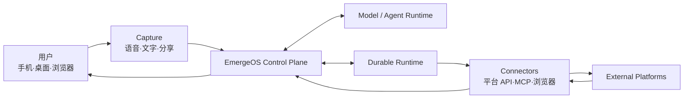
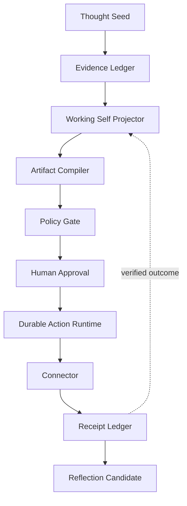

# System Overview

## 架构目标

EmergeOS 的架构首先保护五件事：

1. 用户拥有并能修正系统对自己的理解；
2. 模型上下文与持久真相分离；
3. 外部行动最小授权、可恢复且不重复；
4. 每个结论和结果可以追溯到证据；
5. 模型、Runtime 和平台 Connector 可以替换而不改写产品领域。

## 系统上下文



模型和 Agent Runtime 是被调用的能力，不是系统的所有者。外部平台的真实状态必须通过 Connector Receipt 回流。

## 领域闭环



## 三个控制面

### Product Control Plane

拥有 Self Model、证据、任务、策略、Artifact、Receipt 和演进规则。这是产品核心。

### Agent Control Plane

负责模型选择、工具循环、Worker、上下文压缩和流式事件。必须被 `AgentKernel`
端口隔离。当前只实现一个 fixed、serial、depth=1 的 read-only Worker，不等同于
通用 Subagent graph 或 distributed scheduler。

### Durable Action Plane

负责等待审批、定时、重试、补偿、幂等和崩溃恢复。模型调用和 Connector 调用作为不可靠 Activity 处理。

## 首阶段部署形态

采用模块化单体：

- 一个 Spring Boot API 进程；
- 纯 Java Core；
- 内存适配器保留 Stage 0 确定性演示；
- Stage 2 S1 已有 framework-free、固定步数/工具预算的 Fake Agent 循环；它只注册
  `capture.read`，结果仍由 Core 校验和提交；
- Stage 2 S2 已把 AgentRun、safe hashed Trace、immutable resource binding、
  Result 与 HarnessRunBundle 持久化；成功 Artifact 与 terminal Run 原子提交；
- frozen synthetic Task Pack 可通过 fresh、无网络的 Offline runner 得到 exact
  Trace/Artifact/Bundle golden hashes；
- Stage 2 S3 已有独立 `apps/eval-runner`：默认 packaged command 只做
  zero-egress preflight；显式执行路径绑定 frozen PUBLIC synthetic Task、
  real TTY challenge、30 秒 one-shot permit、POSIX attempt marker/journal 和本地
  hard-link create-only terminal run record；
- Stage 2 S4 已在 isolated `apps/offline-harness-runner` 对固定 Pack 004 执行
  12 次 shared candidate generation / 24 次 VerifierEvaluation，并用不引用
  Runner/generator 的独立 verifier 重建 candidate、重跑 H0/H1、重算完整 report，
  得到 deterministic `VERIFIED_PASSED`；packaged writer 已把相同结果写成 canonical
  durable report，fresh JVM 可只读加载并 independent replay；
- Pack 005 已固定 Tool arguments pre-dispatch fault；Pack 006 已固定 trusted
  read-only Tool 的 post-dispatch deadline truth；Pack007 又增加一个 typed、
  synchronous、depth=1 的 read-only Worker vertical：Fake Conductor 发出
  `WorkerCall`，child 只读同一个 owner-scoped Capture，durable
  `WorkerResultEnvelope` 经 parent verified consume 后才提交 parent-only Artifact；
- Pack008 把 OpenAI model execution profile 只绑定到 exact child，parent 仍是
  non-model-bound Fake Conductor。shipping CLI 只新增
  `--worker-preflight`；graph permit 与 OpenAI graph execution 仅存在于 test/loopback，
  没有 Pack008 live execute route、durable attempt journal 或 product API wiring；
- Pack009 新增 isolated `apps/graph-eval-runner`与 PostgreSQL V7 canonical graph
  attempt：fixed execution slot、manifest、exact Run/profile binding、hash-chain
  journal与 CAS head共享一个 durable authority。independent loopback provider
  durable接收一次 request后，writer JVM被真实强杀；两个 fresh verifier返回相同
  `VALID / INCOMPLETE / billing UNKNOWN`，两种 replay都不能产生第二次 request；
  shipping verify/execute仍禁用，terminal-seal table也只是 disabled skeleton；
- PostgreSQL 已持有 Capture、Artifact lineage、local ActionAttempt/Receipt 与
  AgentRun/Trace/WorkerResult、parent/child Handoff truth；exact profile registry
  可同时解释 Pack007/Pack008/Pack009，且不使用 registration order；
- Stage 1 S3 Action 仅通过 loopback HTTP 调用独立、文件持久化的 Fake Provider；
- OpenAI real-model protocol adapter 与受控 Eval Runner 实现已形成，但只有当前最终验证
  全部通过后才能宣称 runner engineering complete；live-provider smoke 尚未执行，
  没有 real key、real model result 或 billing receipt；
- Temporal、AgentScope 和真实 Connector 仍是后续外层适配器，不是当前实现。

此时拆微服务只会增加一致性、部署和调试成本，不能增加用户价值。未来只有出现独立扩缩、故障隔离、团队所有权或合规边界时才拆服务。

Pack007 当前产品路径是：

```text
owner-scoped Capture
→ server-owned parent Task + Fake Conductor
→ typed WorkerCall
→ child Task/Run（serial，depth=1）
→ capture.read
→ durable WorkerResult + terminal child Trace/Bundle
→ verified parent HANDOFF
→ parent-only Artifact + terminal parent Run
```

registered child `contextPolicyVersion` drift 会在 child Run、Model、Tool 与 delegated
read 前 fail closed。child terminal commit 后、parent terminal commit 前若 JVM
终止，数据库保留 terminal child + WorkerResult 与仍为 `RUNNING` 的 parent；当前不会
自动 resume。Pack007 不使用 Temporal，也没有 workflow graph、parallel scheduling、
distributed Worker service、write-capable Worker 或 live model。

Pack008 当前不是第二条产品路径，而是一条 Verification/Eval baseline：

```text
hash-frozen PUBLIC synthetic Pack008
→ zero-egress preflight
→ exact Fake parent + model-bound child profiles
→ process-local graph permit（test only）
→ loopback OpenAI adapter integration（test only）
→ V6 PostgreSQL multi-profile/fresh-store verification
```

same-JVM fresh Store 不是 fresh JVM/process-kill；process-local permit 也不能提供
crash recovery、billing truth 或 provider-side one-shot。任何 Pack008 live execution
都必须先增加 graph-level operator gate、durable marker/journal/terminal record 与
selected-boundary restart evidence，再取得 owner 对一次 bounded smoke 的独立授权。

Pack009只关闭上述最危险 crash window中的 durable interpretation与 replay boundary：

```text
preprovisioned PUBLIC synthetic Capture
→ synthetic operator gate + create-only execution-slot claim
→ exact parent/child RUNNING + provider intent
→ independent loopback provider accepts request
→ writer process kill before attribution
→ fresh verified read = VALID / INCOMPLETE / UNKNOWN
→ same attempt replay rejected, provider count remains 1
```

这不是 provider request与数据库的原子 transaction，也不证明 external provider、
real key/model result、token/cost receipt、terminal success或真实 owner批准。完整
writer replay需要先读取连接 durable authority的 DB password，但在 provider
credential/client/request前被 claim拒绝。V7 terminal-seal table使用 `CHECK(FALSE)`，
当前没有 terminal seal capability；未来 product execute route还必须进一步收口
library-level authority、真实 TTY、credential broker与 per-user egress consent。

`apps/eval-runner` 属于 Verification/Eval 边界，不属于普通 Product API 或 Durable
Action Plane。它使用单次内存 Store 执行冻结案例；本地 JSON record 只保存该 synthetic
attempt 的 terminal evidence，不替代 PostgreSQL 中 owner-scoped product `AgentRun`。
POSIX marker 只约束当前 host/owner home，不防同 UID、owner/root、跨主机重放，也不是
provider-side idempotency。Journal 的 provider SDK create intent 只能说明一次调用可能
发生；若没有完整 observed usage，billing 必须保持 `UNKNOWN`，不能把零 observed cost
解释成免费。Reservation 是调用前的 authorization ceiling，不是对最终 provider usage 的
改写上限；任何已观察 usage，即使超过 reservation，也必须进入 Result、Bundle 和本地记录。
本地 terminal record 的 create-only commit 只证明 tested local POSIX cooperative
boundary：pending-only 不 authoritative，同 inode target+pending 可解释为 cleanup
residue，不同 inode fail closed；它不把 provider request 与本地文件组成 transaction。

`apps/offline-harness-runner` 同样属于 Verification/Eval 边界，但与上面的
real-model protocol Eval Runner 是两个独立组件。它只处理 fixed PUBLIC synthetic
Pack 004，不访问 provider、产品 Store 或外部平台。其 durable report 使用
owner-local `0700/0600` state、canonical bounded JSON、claim/pending 与 hard-link
create-only commit；claim-only 或 claim+pending/no-target 保持 `UNKNOWN`，
pending 无 claim、不同 inode、unsafe path 或不可信 authoritative target 保持
`INVALID`，同 inode committed residue 可为 `FINAL`。Reader 永不 repair 或 rewrite。
两个 fresh JVM 可以从相同 bytes independent replay，但这仍不是 PostgreSQL product
truth、historical execution attestation 或 Connector Receipt。

该 POSIX boundary 是 cooperative owner/mode restriction：只有 filesystem provider
暴露 ACL 时才检查 visible foreign `ALLOW` ACL，不防同 UID、owner、root 或 hidden
ACL。owner home 会 canonicalize，文件读取后会重新绑定 file identity，但实现没有
`dirfd/openat/openat2`，不能声称消除了 hostile pathname TOCTOU。当前 fault evidence
是选定 phase 的真实 JVM process kill，不是 power-loss、reboot、NFS 或 storage
corruption。unkeyed hash 与 independent replay 发现不一致，不提供 signature、
producer authentication、WORM 或 non-repudiation。

## ETCLOVG 映射

| 层 | EmergeOS 所有权 |
|---|---|
| Execution | 沙箱与可替换执行后端 |
| Tool | Connector Registry、Schema、版本、健康和权限 |
| Context | Evidence、Self Model、Working Self 与漂移检测 |
| Lifecycle | 领域状态机、AgentKernel 与 Durable Runtime |
| Observability | Trace、成本、版本、事件和 HarnessRunBundle |
| Verification | Readiness、结果/轨迹/评测器检查和回归 |
| Governance | 身份、委托、Capability、审批、审计和删除 |
