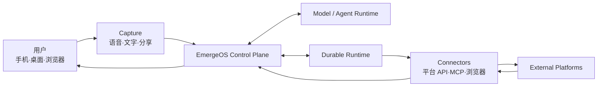
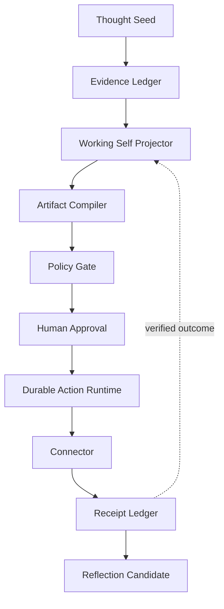

# System Overview

## 架构目标

EmergeOS 的架构首先保护五件事：

1. 用户拥有并能修正系统对自己的理解；
2. 模型上下文与持久真相分离；
3. 外部行动最小授权、可恢复且不重复；
4. 每个结论和结果可以追溯到证据；
5. 模型、Runtime 和平台 Connector 可以替换而不改写产品领域。

## 系统上下文

模型和 Agent Runtime 是被调用的能力，不是系统的所有者。外部平台的真实状态必须通过 Connector Receipt 回流。

## 领域闭环

## 三个控制面

### Product Control Plane

拥有 Self Model、证据、任务、策略、Artifact、Receipt 和演进规则。这是产品核心。

### Agent Control Plane

负责模型选择、工具循环、Subagent、上下文压缩和流式事件。必须被 `AgentKernel` 端口隔离。

### Durable Action Plane

负责等待审批、定时、重试、补偿、幂等和崩溃恢复。模型调用和 Connector 调用作为不可靠 Activity 处理。

## 首阶段部署形态

采用模块化单体：

- 一个 Spring Boot API 进程；
- 纯 Java Core；
- 内存适配器保留 Stage 0 确定性演示；
- Stage 2 S1 已有 framework-free、固定步数/工具预算的 Fake Agent 循环；它只注册
  `capture.read`，结果仍由 Core 校验和提交；
- Stage 2 S2 已把 AgentRun、safe hashed Trace、immutable resource binding、
  Result 与 HarnessRunBundle 持久化；成功 Artifact 与 terminal Run 原子提交；
- frozen synthetic Task Pack 可通过 fresh、无网络的 Offline runner 得到 exact
  Trace/Artifact/Bundle golden hashes；
- Stage 2 S3 已有独立 `apps/eval-runner`：默认 packaged command 只做
  zero-egress preflight；显式执行路径绑定 frozen PUBLIC synthetic Task、
  real TTY challenge、30 秒 one-shot permit、POSIX attempt marker/journal 和本地
  atomic terminal run record；
- Stage 2 S4 已在 isolated `apps/offline-harness-runner` 对固定 Pack 004 执行
  12 次 shared candidate generation / 24 次 VerifierEvaluation，并用不引用
  Runner/generator 的独立 verifier 重建 candidate、重跑 H0/H1、重算完整 report，
  得到 deterministic `VERIFIED_PASSED`；report 仍只存在于内存，不是 durable receipt；
- PostgreSQL 已持有 Capture、Artifact lineage、local ActionAttempt/Receipt 与
  AgentRun truth；
- Stage 1 S3 Action 仅通过 loopback HTTP 调用独立、文件持久化的 Fake Provider；
- OpenAI real-model protocol adapter 与受控 Eval Runner 实现已形成，但只有当前最终验证
  全部通过后才能宣称 runner engineering complete；live-provider smoke 尚未执行，
  没有 real key、real model result 或 billing receipt；
- Temporal、AgentScope 和真实 Connector 仍是后续外层适配器，不是当前实现。

此时拆微服务只会增加一致性、部署和调试成本，不能增加用户价值。未来只有出现独立扩缩、故障隔离、团队所有权或合规边界时才拆服务。

`apps/eval-runner` 属于 Verification/Eval 边界，不属于普通 Product API 或 Durable
Action Plane。它使用单次内存 Store 执行冻结案例；本地 JSON record 只保存该 synthetic
attempt 的 terminal evidence，不替代 PostgreSQL 中 owner-scoped product `AgentRun`。
POSIX marker 只约束当前 host/owner home，不防同 UID、owner/root、跨主机重放，也不是
provider-side idempotency。Journal 的 provider SDK create intent 只能说明一次调用可能
发生；若没有完整 observed usage，billing 必须保持 `UNKNOWN`，不能把零 observed cost
解释成免费。Reservation 是调用前的 authorization ceiling，不是对最终 provider usage 的
改写上限；任何已观察 usage，即使超过 reservation，也必须进入 Result、Bundle 和本地记录。

## ETCLOVG 映射

| 层 | EmergeOS 所有权 |
|---|---|
| Execution | 沙箱与可替换执行后端 |
| Tool | Connector Registry、Schema、版本、健康和权限 |
| Context | Evidence、Self Model、Working Self 与漂移检测 |
| Lifecycle | 领域状态机、AgentKernel 与 Durable Runtime |
| Observability | Trace、成本、版本、事件和 HarnessRunBundle |
| Verification | Readiness、结果/轨迹/评测器检查和回归 |
| Governance | 身份、委托、Capability、审批、审计和删除 |
