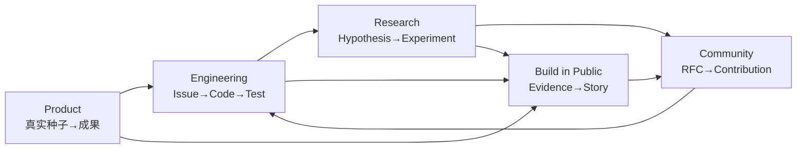

# Operating Model

EmergeOS 的运营不是“每天宣传一个宏大愿景”，而是把产品研发、研究证据、社区贡献和内容表达连接成一条可追溯循环。

## 五条运行回路



### 产品回路

真实使用 → 修改与回执 → 问题分类 → 产品假设。用户行为不能不经审查直接改写人格或路线图。

### 工程回路

Task Brief / ExecPlan slice delta → Red → 最小变更 → Refactor → 故障证据 → 独立 Review
→ Release → Regression。

### 研究回路

可证伪问题 → 固定条件 → 对照实验 → 结果与限制 → ADR 或继续探索。

### 社区回路

Discussion → RFC → Spike → ADR → 实现。社区共同演进的是代码、协议、评测和方法，不是用户数据。

### 公开构建回路

只从已验证的工作生成内容：

```text
完成了什么
为什么这样设计
证据与演示
失败与限制
学到的原理
下一假设
```

再适配微博、X、小红书、视频与公众号。首阶段全部人工批准。

## 节奏

- 每个有意义切片：相关 Outcome Receipt；不强行凑齐五项目标。
- 每日：形成私有三行证据日志和一份待审内容草稿；可发布愿景/假设，但必须明确标签，产品
  完成声明只能来自已验证证据。
- 每周：汇总公开真实完成、失败、证据和下一假设。以有效回复、访谈、试用、留资或付款等
  获客信号评估内容，不把发帖数量当结果。
- 双周：一个可运行版本或一个明确的实验结论。
- 每月：Roadmap、成本、质量和社区贡献回顾。
- 重要事故：脱敏 Postmortem 与回归用例。
- 每季度：越权、重复行动、数据事件、回滚和模型更换透明度报告。

每周还要检查五个结果轴：AI Coding、Agent Engineering、Product/Production、Career 和
Business。连续 7 天没有用户接触，或连续两个基础设施切片没有用户/市场证据时，冻结新增
基础设施；每周 Pulse、每月填写 [Five-Outcome Scorecard](./five-outcome-scorecard.md)。

## 工作流状态

```text
IDEA → EVIDENCE_NEEDED → READY
→ IN_PROGRESS → IN_REVIEW → VERIFIED
→ RELEASED | REJECTED | DEFERRED
```

只有 `VERIFIED` 的事实可以写入发布说明或对外声称已实现。

## 组织领域

| 领域 | 核心责任 |
|---|---|
| Product & Experience | Thought-to-Outcome 与低摩擦交互 |
| Self & Memory | Evidence、Self Model、Working Self、纠正与删除 |
| Agent & Runtime | AgentKernel、编排、模型路由与 Durable Runtime |
| Action & Connectors | Policy、Capability、平台、幂等与 Receipt |
| Verification & Safety | Eval、Trace、故障注入、隐私与治理 |
| Community & Narrative | RFC、文档、翻译、Build in Public |

早期一个人可以承担多个领域，但每项工作仍要标注领域和验收人，避免责任隐形。

## Codex 研发分工

主 Agent 维护问题、约束、架构建议、验证执行和证据汇总；人类所有者承担风险并决定里程碑
go/no-go。Subagent 优先承担 read-oriented 探索、官方文档核验、测试/故障矩阵和独立 Review；
一个工作树只有一个代码写入者。详细协议见
[Codex Development Playbook](../engineering/codex-playbook.md)。
