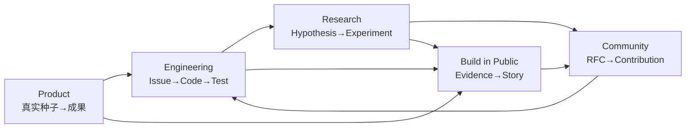

# Operating Model

EmergeOS 的运营不是“每天宣传一个宏大愿景”，而是把产品研发、研究证据、社区贡献和内容表达连接成一条可追溯循环。

## 五条运行回路



### 产品回路

真实使用 → 修改与回执 → 问题分类 → 产品假设。用户行为不能不经审查直接改写人格或路线图。

### 工程回路

Issue → 最小变更 → 测试与 HarnessRunBundle → Review → Release → Regression。

### 研究回路

可证伪问题 → 固定条件 → 对照实验 → 结果与限制 → ADR 或继续探索。

### 社区回路

Discussion → RFC → Spike → ADR → 实现。社区共同演进的是代码、协议、评测和方法，不是用户数据。

### 公开构建回路

只从已验证的工作生成内容：

```text
完成了什么
为什么这样设计
证据与演示
失败与限制
学到的原理
下一假设
```

再适配微博、X、小红书、视频与公众号。首阶段全部人工批准。

## 节奏

- 每日：内部 Build Note，可为空，不虚构进展。
- 每周：公开真实完成、失败、证据和下一假设。
- 双周：一个可运行版本或一个明确的实验结论。
- 每月：Roadmap、成本、质量和社区贡献回顾。
- 重要事故：脱敏 Postmortem 与回归用例。
- 每季度：越权、重复行动、数据事件、回滚和模型更换透明度报告。

## 工作流状态

```text
IDEA → EVIDENCE_NEEDED → READY
→ IN_PROGRESS → IN_REVIEW → VERIFIED
→ RELEASED | REJECTED | DEFERRED
```

只有 `VERIFIED` 的事实可以写入发布说明或对外声称已实现。

## 组织领域

| 领域 | 核心责任 |
|---|---|
| Product & Experience | Thought-to-Outcome 与低摩擦交互 |
| Self & Memory | Evidence、Self Model、Working Self、纠正与删除 |
| Agent & Runtime | AgentKernel、编排、模型路由与 Durable Runtime |
| Action & Connectors | Policy、Capability、平台、幂等与 Receipt |
| Verification & Safety | Eval、Trace、故障注入、隐私与治理 |
| Community & Narrative | RFC、文档、翻译、Build in Public |

早期一个人可以承担多个领域，但每项工作仍要标注领域和验收人，避免责任隐形。

